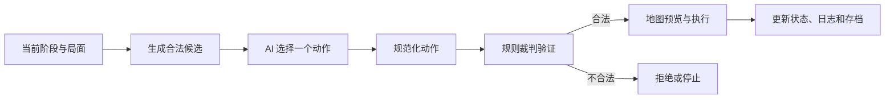

# 阿拉曼裁判工作室 AI 设计文档

**对应版本：** v2026.07.12.95  
**更新日期：** 2026 年 7 月 26 日

本目录把三种 AI 分开说明。它们共享同一套游戏状态、动作协议和规则裁判，但决策方法并不相同。

## 文档导航

### 1. 简单规则 AI

[简单规则 AI 设计说明](./简单规则AI设计.md)

适合了解项目最基础、最稳定的自动决策方式。它枚举当前阶段的合法动作，使用较小的直接评分公式排序，然后选择最高分动作。

重点回答：

- 它是不是随机行动；
- 移动和战斗如何评分；
- 为什么它能完成对局但战术较弱；
- 它在测试体系中的作用。

### 2. 复杂规则 AI

[复杂规则 AI 设计说明](./复杂规则AI设计.md)

适合了解本地 AI 如何利用目标、补给、控制区、地形、战斗结果表和场景规则形成更明确的战术倾向。

重点回答：

- 它到底有没有战术；
- 为什么有合法战斗时仍可能不攻击；
- 联合攻击如何参与评分；
- 七月、九月和十月场景如何采用不同策略；
- 十月轴心国如何判断撤出优先级。

### 3. 模型指挥官 AI

[模型指挥官 AI 设计说明](./模型指挥官AI设计.md)

适合了解外接大模型的完整接入方式，包括系统提示、上下文、候选动作、只读工具、结构化输出、路径规划、最终动作复核和 API 评估。

重点回答：

- 模型知道自己是游戏代理吗；
- 模型能看到哪些双方单位和地图信息；
- 模型拿到的是不是全部候选动作；
- 模型一次能操作到什么粒度；
- 移动和战斗分别输出什么；
- 模型能不能指定骰点或绕过规则；
- 输出错误时系统如何修正和停止。

## 三种 AI 的直接区别

| 对比项 | 简单规则 AI | 复杂规则 AI | 模型指挥官 AI |
| --- | --- | --- | --- |
| 决策核心 | 小型加权评分 | 场景化加权评分 | 外接模型基于结构化上下文推理 |
| 合法候选来源 | 本地裁判 | 本地裁判 | 本地裁判提供主要候选，模型还可调用工具扩展查询 |
| 是否调用 API | 否 | 否 | 是 |
| 是否读取双方局面 | 读取评分所需数据 | 读取战场、补给、目标和场景数据 | 接收双方部队摘要、单位索引、地图情报和候选评估 |
| 是否考虑补给 | 基础惩罚 | 详细考虑 | 上下文与工具均提供补给信息 |
| 是否考虑 CRT 六个结果 | 使用平均风险值 | 统计双方风险和战略价值 | 直接收到候选的赔率、六面结果及风险摘要 |
| 是否主动放弃不利战斗 | 能力有限 | 有明确战斗门槛 | 可选择 `pass`，但会接受最终动作质量复核 |
| 是否具备场景专用策略 | 很少 | 有，尤其是十月撤出 | 从场景任务、胜利条件和候选评估中决策 |
| 是否进行多回合搜索 | 否 | 否 | 当前也不进行正式搜索树规划 |
| 主要用途 | 基线对手、回归测试 | 本地正式对手 | 大模型游戏代理与 AI 研究 |

## 共同底座

三种 AI 都不能直接写入游戏状态。共同执行链为：

共同规则包括：

- 一次 AI 决策只提交一个最终动作。
- 移动阶段不能提交战斗。
- 战斗阶段不能提交移动。
- 所有移动路径都要检查移动力、地形、道路、控制区、雷区和堆叠。
- 所有战斗都要检查攻击者、目标、攻防值、赔率和 CRT。
- 战斗骰点由前端裁判生成，AI 不能自行填写。
- 强制撤退由裁判处理，AI 控制方使用自动撤退规划器。
- 终局和 VP 由场景规则判定，AI 不能自行宣布胜负。

## 相关完整文档

[AI 完整技术说明](../阿拉曼裁判工作室_AI设计说明_2026-07-26.md)保留了共同架构、自动播放、动作预算、测试体系和完整输入输出示例，可作为技术总参考。
