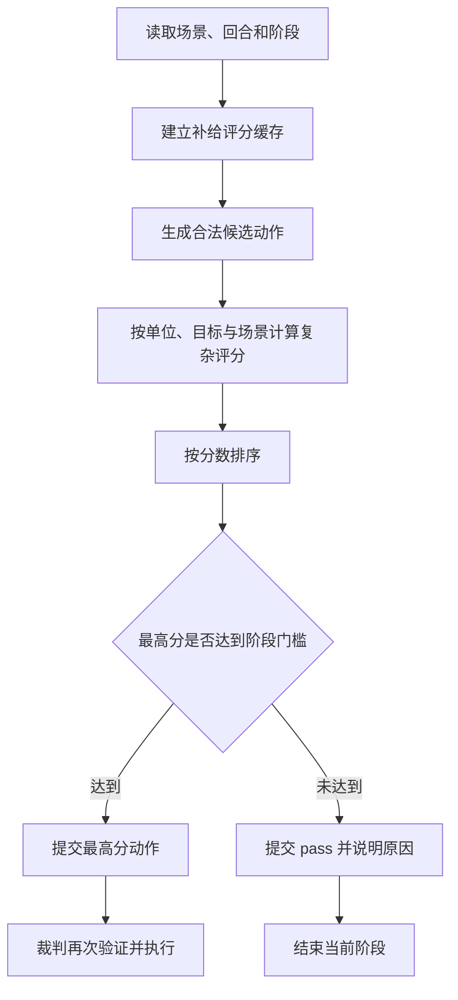

# 复杂规则 AI 设计说明

**控制器值：** `rules_ai`  
**界面名称：** 复杂规则 AI  
**主要实现：** `suggestRulesAction()`、`rulesAiScore()`

## 1. 定位

复杂规则 AI 是当前项目的本地正式对手。它不调用外部模型，而是通过更完整的战场特征和场景策略为动作评分。

它的目标不是简单地“能走就走、能打就打”，而是尽量做到：

- 围绕场景胜利目标行动；
- 保持补给；
- 避免脆弱单位无意义接敌；
- 利用地形、道路和控制区；
- 只在预期结果值得时战斗；
- 在十月场景中按时组织轴心国向西撤出。

它仍然属于加权启发式系统，不是搜索树 AI。

## 2. 与简单规则 AI 的区别

| 项目 | 简单规则 AI | 复杂规则 AI |
| --- | --- | --- |
| 主要目标 | 当前一步向目标靠近 | 当前一步对场景胜利的综合价值 |
| 补给 | 基础状态惩罚 | 结合孤立、暴露和补给单位安全 |
| 控制区 | 固定惩罚 | 结合控制区来源数量和附近敌军强度 |
| 地形 | 少量固定加分 | 结合单位、目标和战术环境 |
| 战斗 | 赔率和平均结果 | 赔率、六面结果、目标价值、撤退空间和双方风险 |
| 场景策略 | 很少 | 七月推进、盟军局部拦截、十月撤出 |
| 是否会主动不攻击 | 能力有限 | 有明确最低分数门槛 |

## 3. 输入

复杂规则 AI 直接读取当前游戏状态，主要包括：

- 场景和回合；
- 距离最终回合的剩余时间；
- 当前行动方和阶段；
- 单位位置、攻防、移动力和单位类型；
- 机械化、工兵、补给等单位属性；
- 单位当前补给状态；
- 敌军控制区来源；
- 相邻敌军战斗力；
- 雷区；
- 地形；
- 道路；
- 阿拉曼目标区；
- 场景补给源与 VP 条件；
- 本地裁判已经确认合法的移动和战斗候选。

## 4. 总体决策流程



## 5. 单位优先级

复杂规则 AI 不会平均枚举所有单位。它先判断哪些单位更值得在当前阶段获得候选空间。

优先级会考虑：

- 到当前战略目标的距离；
- 攻击力和移动力；
- 是否为补给单位；
- 是否已经接近目标区；
- 轴心国是否需要向东推进；
- 盟军是否需要拦截附近敌军；
- 十月轴心国单位是否能够及时撤出；
- 补给单位是否应先向西集结或撤出。

这一步用于控制候选数量和计算时间，不是规则限制。没有被优先枚举的单位仍可能按原版规则合法行动。

## 6. 移动目标设计

### 6.1 轴心国一般目标

在七月和九月等推进型场景中，轴心国主目标是阿拉曼和东部胜利区域。

AI 会奖励向目标取得的有效进展，并在最后几回合提高接近目标的紧迫度。

### 6.2 盟军一般目标

盟军不会简单地把轴心国补给源当成所有单位的全局目标。

其设计倾向是：

- 守住阿拉曼核心区；
- 保持补给；
- 接近并拦截附近轴心国；
- 避免无意义向西深入；
- 不轻易离开关键防区。

### 6.3 补给单位目标

补给单位寻找需要跟随的友军前线或撤退目标。

AI 会特别惩罚：

- 补给单位进入敌军控制区；
- 补给单位脱离编队；
- 为了少量距离收益暴露补给单位。

## 7. 移动评分

一个合法移动动作的最终评分由多类因素组合。

### 7.1 目标进展

- 起点到目标的距离；
- 终点到目标的距离；
- 实际前进格数；
- 到终局还剩多少回合；
- 终局前是否已经足够接近目标。

### 7.2 行军方向

- 轴心国一般向东推进；
- 盟军围绕附近威胁和阿拉曼防区调整；
- 十月轴心国向西撤退；
- 逆主要方向的移动会受到惩罚，除非它符合局部拦截或撤退逻辑。

### 7.3 接敌风险

- 目标格有多少敌军控制区来源；
- 相邻敌军总战斗力；
- 自身防御力是否足以承受接敌；
- 防御力较低的单位是否主动进入接触；
- 目标格是否有敌军雷区；
- 单位是否为工兵。

### 7.4 补给风险

- 当前是否有补给；
- 是否部分补给；
- 是否孤立；
- 补给单位是否暴露；
- 移动是否破坏编队和补给关系。

### 7.5 地形与道路

- 山脊的防御价值；
- 阿拉曼方框区域的目标价值；
- 道路模式是否在不接敌的情况下节省移动；
- 道路模式是否适合补给单位；
- 路径实际消耗的移动力。

### 7.6 单位价值

- 攻击力；
- 移动力；
- 单位类型；
- 在场景中的潜在 VP 价值。

## 8. 战斗候选

复杂规则 AI 只评估本地裁判确认合法的战斗。

候选生成器会为相邻敌军格构造：

- 单单位攻击；
- 攻击力最高的两个单位联合攻击；
- 攻击力最高的三个单位联合攻击；
- 所有相邻单位联合攻击。

每个候选必须满足：

- 攻击者为当前行动方；
- 攻击者仍为 `fresh`；
- 本阶段和本回合未攻击；
- 攻击者不处于孤立；
- 攻击者未被未清除敌方雷区阻断；
- 攻击者与目标相邻；
- 所有规则要求的防御格均已列入。

## 9. 战斗评分

复杂规则 AI 不是只看 `2:1` 或 `3:1` 这个赔率字符串，而是查看整个赔率列的六个结果。

### 9.1 CRT 结果统计

它会统计：

- 防御方消灭骰面；
- 防御方撤退骰面；
- 攻击方消灭骰面；
- 攻击方撤退骰面；
- 交换结果骰面；
- 对防御方造成损害的总骰面；
- 对攻击方造成损害的总骰面。

### 9.2 战略加分

- 目标是阿拉曼主目标格；
- 目标位于阿拉曼方框；
- 目标包含重要补给单位；
- 防御方撤退空间有限；
- 攻击力明显高于防御力；
- 战斗有机会打开通向胜利区或补给线的道路。

### 9.3 风险扣分

- 低赔率；
- 多个骰面会导致攻击方撤退或消灭；
- 交换结果概率较高；
- 为小目标投入过多高价值单位。

## 10. 为什么会放弃合法战斗

复杂规则 AI 的战斗最低执行分数为 `165`。

如果最高分战斗低于门槛，AI 返回 `pass`。原因会区分为：

- 没有相邻且合法的攻击目标；
- 有合法攻击，但当前赔率或预期战果不利，选择保存兵力。

因此，“AI 没有战斗”不一定是不会战斗，也可能是评估后主动不打。

这一设计目前是固定阈值，后续可按场景、剩余回合和胜负差动态调整。

## 11. 十月轴心国撤出策略

十月场景有独立的后期目标。

### 11.1 第 10 回合前

- 轴心国单位逐步向西部集结；
- 补给单位根据移动力前往不同预备位置；
- 避免继续向东投入无法收回的兵力。

### 11.2 第 10 回合后

- 西边缘合法单位优先提交 `exit_west`；
- 补给单位撤出获得较高优先级；
- 高攻防作战单位获得更高撤出价值；
- 根据当前位置列号和移动力估算到达西边缘需要几回合；
- 根据场景最终回合判断是否仍来得及撤出；
- 把有限动作预算优先给最可能成功撤出的单位。

撤出动作仍必须由裁判检查：场景、回合、阵营、阶段、单位类型和西边缘位置缺一不可。

## 12. 阶段执行门槛

复杂规则 AI 不会对所有非 `pass` 动作一概执行。

当前最低分数为：

| 阶段 | 最低分数 |
| --- | ---: |
| 战斗 | 165 |
| 补给移动 | 2 |
| 轴心国其他移动 | 4 |
| 盟军其他移动 | 6 |

没有动作达到门槛时，AI 会结束阶段。这些门槛属于当前产品策略参数，不是原版规则。

## 13. 输出

复杂规则 AI 返回：

- AI 类型；
- 当前策略说明；
- 当前目标；
- 最终动作；
- 前 10 个候选及其分数。

例如：

```json
{
  "type": "rules",
  "target": "3711",
  "action": {
    "type": "combat",
    "attackers": ["axis-unit-a", "axis-unit-b"],
    "defender_hexes": ["3414"]
  },
  "candidates": [
    {
      "score": 181,
      "action": {
        "type": "combat",
        "attackers": ["axis-unit-a", "axis-unit-b"],
        "defender_hexes": ["3414"],
        "odds_column": "2-1"
      }
    }
  ]
}
```

最终战斗动作不包含骰点。骰点由前端裁判生成。

## 14. 优点

- 不依赖网络。
- 比简单规则 AI 更重视场景目标和补给。
- 能理解联合攻击候选的预期收益。
- 能主动避免不利战斗。
- 能区分轴心国推进与盟军拦截。
- 具有十月后期撤出策略。
- 评分和候选可记录、可解释、可重复。

## 15. 局限

- 没有 Minimax、MCTS 或强化学习。
- 不搜索多回合状态树。
- 多单位协同主要体现在联合攻击候选，而不是完整行动计划。
- 固定权重可能在少数特殊局面失效。
- 十月策略属于场景专用规则，通用性有限。
- 候选生成受性能上限约束，不会枚举每条路线。
- 阶段动作预算可能让部分合法单位不行动。

## 16. 后续改进

- 把战斗门槛改为随回合、VP 和阵营目标变化的动态阈值。
- 保存一个短期战役计划，但每次执行前重新验证。
- 增加两步或三步序列评估。
- 单独记录规则可行性、战术收益、补给风险和 VP 影响。
- 用固定局面集自动调节权重。
- 比较复杂规则 AI 与模型指挥官在相同局面的选择差异。

## 17. 适合怎样理解它

复杂规则 AI 可以理解为一个“带场景知识的战术评分器”。

它确实具有战术倾向，包括保持补给、避免脆弱接敌、选择联合攻击、放弃不利战斗和组织十月撤出；但这些能力来自人工设计的特征和权重，不代表它已经具备通用的长期战略搜索能力。
