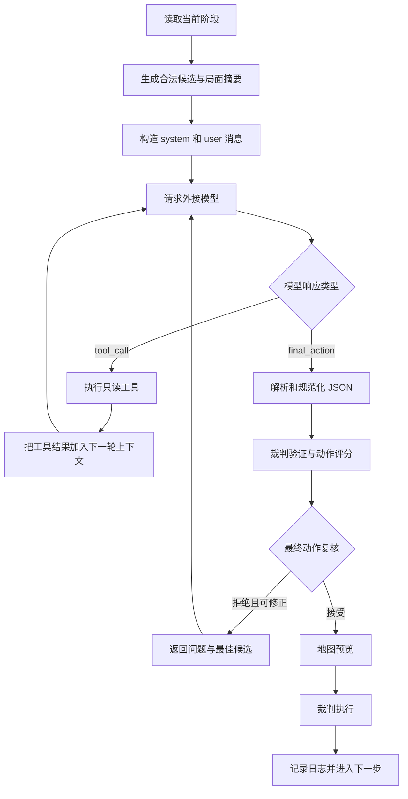

# 模型指挥官 AI 设计说明

**控制器值：** `external_ai`  
**界面名称：** 模型指挥官 AI  
**默认提供方：** DeepSeek  
**默认模型：** `deepseek-v4-flash`  
**主要实现：** 外接模型上下文、只读工具、动作复核与前端裁判

## 1. 定位

模型指挥官 AI 是通过外部大模型 API 操作游戏的控制器。

它不是让模型直接控制网页，也不是让模型模拟裁判。模型的职责是：

1. 阅读当前阵营的任务与局面。
2. 分析胜利条件、部队、补给、地图和候选动作。
3. 必要时调用只读工具查询规则结果。
4. 提交一个结构化最终动作。

前端负责路径规划、合法性验证、随机骰点、状态更新和视觉播放。

## 2. 为什么把模型定义为 game agent

如果只告诉大模型“分析这个兵棋局面”，它很容易返回规则解释或泛泛建议，而不是可执行行动。

系统提示明确规定：

- 你是当前阵营的游戏代理；
- 你的目标是赢得场景；
- 你不是被动规则助手；
- 优先考虑胜利条件、节奏、补给、兵力保存和位置压力；
- 不得发明规则；
- 不确定时先调用工具；
- 最终必须返回紧凑 JSON。

这样模型知道自己必须做决策，而不是只做讲解。

## 3. API 配置

当前非秘密默认配置为：

| 项目 | 当前值 |
| --- | --- |
| API 类型 | Chat Completions |
| 模型 | `deepseek-v4-flash` |
| 温度 | `0.25` |
| 最大输出 | 3600 tokens |
| JSON 修复最大输出 | 900 tokens |
| 超时 | 30 秒 |
| 最大工具轮数 | 4 |
| 响应格式 | JSON object |

API Key 不保存在源码中，也不应进入 Git 历史。它通过本地私有配置或界面配置提供。

## 4. 一次决策的完整流程



模型每次只决定一个动作。一个动作执行后，系统重新构造最新上下文，不会盲目继续执行旧计划。

## 5. 不同阶段允许的动作

| 阶段 | 模型可提交 |
| --- | --- |
| 初始移动 | `move_intent`、`move`、特定条件下的 `exit_west`、`pass` |
| 机械化移动 | `move_intent`、`move`、特定条件下的 `exit_west`、`pass` |
| 补给移动 | `move_intent`、`move`、特定条件下的 `exit_west`、`pass` |
| 战斗 | `combat`、`pass` |
| 其他阶段 | 通常只有 `pass` |

当前阶段的允许动作会直接写入 `protocol.current_phase_allowed_actions`。模型不会在移动阶段同时收到全部战斗候选。

## 6. 给模型的上下文

上下文采用结构化、有限、阶段化设计，不直接转储完整存档。

### 6.1 协议与任务

- 当前允许的动作；
- 工具调用格式；
- 最终动作格式；
- 压缩字段含义；
- 当前阵营和对手；
- 当前阶段目标；
- 赢得场景的总体任务。

### 6.2 游戏与胜利条件

- 场景；
- 当前回合；
- 最终回合；
- 剩余回合；
- 当前阶段；
- 当前行动方；
- 当前 VP；
- VP 等级；
- 双方得分方向；
- 阿拉曼和场景特殊目标。

### 6.3 双方单位

模型收到双方部队，不只收到当前能移动的单位。

每方部队使用两层表示：

1. 最多 40 个重点单位的详细摘要。
2. 最多 160 个单位的紧凑索引。

详细单位包括：

- ID 和名称；
- 阵营；
- 所在格；
- 单位种类；
- 攻击力；
- 防御力；
- 移动力；
- 当前状态；
- 补给状态；
- 是否机械化；
- 所在地形；
- 所在作战区域；
- 有效攻击、防御和移动能力；
- 到目标的距离；
- 是否位于敌军控制区；
- 当前能否移动或攻击；
- 附近最多三个敌军单位。

紧凑索引保留：

- 位置；
- 类型；
- 攻击；
- 防御；
- 移动力；
- 状态；
- 补给；
- 作战区域编码。

因此模型能知道己方和敌方棋子的位置、区域与主要能力值。超过详细上限的单位通常仍在紧凑索引中，需要更多信息时可调用工具。

### 6.4 战场摘要

系统按区域统计：

- 双方单位数；
- 双方作战单位数；
- 总攻击与总防御；
- 可行动单位数；
- 有补给、部分补给和孤立单位数；
- 接触格；
- 最接近阿拉曼的双方单位；
- 阿拉曼附近四格范围内的单位。

区域编码区分北部、中央、南部，以及西部、中部、东部作战纵深。

### 6.5 地图情报

最多提供 16 个与当前决策最有关的格子，包括：

- 阿拉曼主目标；
- 双方补给源；
- 候选移动目的地；
- 候选战斗目标；
- 当前接触或危险格。

每格可包含地形、单位、雷区、控制区、道路邻格和到目标的距离。

### 6.6 近期日志

最多提供最近 8 条行动日志，让模型知道刚刚发生了什么，例如：

- 哪个单位移动；
- 哪一场战斗发生；
- 是否有人跳过战斗；
- 当前已经推进到哪个阶段。

当前日志是短期记忆，不是跨整场战役的正式计划记忆。

## 7. 候选动作

### 7.1 是否给模型全部候选

不是。

本地最多从 60 个合法动作中进行筛选，默认只把最多 12 个主要候选发给模型，其中保留一个 `pass` 作为兜底。

候选数量受限是为了：

- 控制请求长度；
- 降低 API 延迟；
- 避免大量相似路径分散模型注意力；
- 让模型优先比较有战略意义的动作。

### 7.2 每个候选包含什么

移动候选可以包含：

- 单位；
- 完整路径；
- 模式；
- 目的地；
- 移动力消耗；
- 目标距离变化；
- VP 相关性；
- 地形和区域；
- 敌军控制区来源；
- 雷区；
- 附近敌军；
- 战术标签；
- 风险。

战斗候选可以包含：

- 攻击单位；
- 防御格；
- 攻击力；
- 防御力；
- 赔率；
- 六个骰面的 CRT 结果；
- 防御方损失与撤退骰面数；
- 攻击方损失与撤退骰面数；
- 目标地形；
- 目标单位补给；
- 撤退空间估计；
- 战略价值和风险。

### 7.3 如何查看候选外的动作

模型可以：

- 调用 `list_legal_actions` 查看更多动作；
- 调用 `find_path` 查询指定目标；
- 调用 `check_move` 检查自选路径；
- 调用 `evaluate_action` 评估非候选动作。

系统提示要求模型在提交非候选动作前先使用 `evaluate_action` 与最佳候选比较。

## 8. 八种只读工具

| 工具 | 输入 | 返回 |
| --- | --- | --- |
| `list_legal_actions` | 数量上限 | 已评分合法动作、风险与标签 |
| `check_move` | 单位、路径、模式 | 合法性与移动裁定 |
| `find_path` | 单位、目标、模式 | 完整合法路径与裁定 |
| `check_combat` | 攻击者、防御格 | 合法性、攻防、赔率和六面 CRT |
| `inspect_unit` | 单位 ID | 单位属性、补给、地形和行动资格 |
| `inspect_hex` | 格号 | 地形、单位、雷区和控制区 |
| `trace_supply` | 单位 ID | 补给状态和补给路径 |
| `evaluate_action` | 完整动作 | 合法性、评分、候选排名、风险与战术标签 |

工具只返回信息，不会修改状态。即使模型调用 `find_path`，单位也不会自动移动。

## 9. 响应协议

### 9.1 工具调用

```json
{
  "type": "tool_call",
  "tool": "trace_supply",
  "arguments": {
    "unit": "july-62-It-mech-01"
  }
}
```

### 9.2 最终动作

```json
{
  "type": "final_action",
  "reason": "推进至目标区并保持补给",
  "action": {
    "type": "move_intent",
    "unit": "july-62-It-mech-01",
    "destination": "3709",
    "mode": "auto"
  }
}
```

模型只能返回一个紧凑 JSON 对象，不能在前后附加 Markdown 或解释正文。

## 10. 移动设计

### 10.1 模型的推荐操作粒度

模型只输出：

- 哪个单位；
- 到哪个格子；
- 路径模式使用 `auto`。

这就是 `move_intent`。

### 10.2 本地路径规划

收到意图后，前端：

1. 标准化目的地格号。
2. 分别尝试普通与道路模式。
3. 使用 `findLegalPath()` 生成完整路径。
4. 使用 `checkMove()` 再次验证。
5. 比较两种路线的复杂规则评分。
6. 选择评分更高的合法路线。

最终执行动作可能是：

```json
{
  "type": "move",
  "unit": "july-62-It-mech-01",
  "path": ["3208", "3308", "3407", "3508", "3608", "3709"],
  "mode": "normal"
}
```

路径仍检查移动力、地形、道路、敌军占据、控制区、雷区和堆叠。让模型只报目标格并不代表忽略路径规则。

## 11. 战斗设计

模型在战斗阶段提交：

```json
{
  "type": "final_action",
  "reason": "联合攻击提高赔率并压迫补给目标",
  "action": {
    "type": "combat",
    "attackers": ["axis-unit-a", "axis-unit-b"],
    "defender_hexes": ["3414"]
  }
}
```

模型可以选择多个相邻己方单位进行联合攻击。

模型不能决定：

- 骰点；
- CRT 结果；
- 哪些单位被消灭；
- 撤退到哪里；
- 是否绕过强制撤退。

前端裁判在执行时随机生成 1d6，再根据真实攻防值、赔率和 CRT 结算。

## 12. 撤退

如果战斗结果要求 AI 控制方撤退，模型不需要再发 API 请求决定每一格。

规则引擎的 `autoPlanRetreats()` 会：

- 一次处理一个单位；
- 一次规划该单位要求的完整撤退距离；
- 每一步选择当前最高优先级的合法格；
- 检查敌军、控制区、雷区、地形和堆叠；
- 无路可退时按规则消灭单位。

这部分属于裁判强制结果，不属于模型自由决策。

## 13. 最终动作复核

模型输出先经过 `validateAiAction()`，再经过 `finalActionReviewForAi()`。

以下动作会被拒绝并获得一次修正机会：

- 不合法动作；
- 没有改变位置的移动；
- 有有用动作时无理由 `pass`；
- 候选排名低于第 5 且比最佳候选低超过 20 分；
- 非候选动作比最佳候选低超过 20 分。

修正上下文会提供：

- 拒绝原因；
- 原动作评估；
- 最佳候选；
- 选择更强合法动作的明确指令。

如果模型第二次仍返回低质量动作，系统不会无限循环复核。

## 14. 格式错误处理

如果模型返回无法解析的 JSON，系统进行一次格式修复：

- 修复请求温度为 0；
- 只要求输出一个合法 JSON 对象；
- 附带允许的结构；
- 不允许 Markdown；
- 仍失败时停止 AI 自动执行。

网络失败、超时和 API 错误也会停止自动执行，并在界面显示原因。

## 15. 行动播放

模型动作通过后，前端不会立即无提示地改状态。

移动会显示：

- 当前行动单位；
- 路线；
- 目标格；
- 最终落点。

战斗会显示：

- 所有攻击者；
- 防御目标；
- 攻击与防御；
- 赔率；
- 随机骰点；
- CRT 结果；
- 撤退或消灭结果。

模型选择 `pass` 时，日志显示跳过原因。

## 16. 一次输入输出示例

局面摘要：

```json
{
  "game": {
    "scenario": "july",
    "turn": 7,
    "final_turn": 7,
    "turns_remaining": 1,
    "phase": "axis_initial_movement",
    "active_side": "axis"
  },
  "decision_brief": {
    "allowed": ["move_intent", "move", "pass"],
    "top": {
      "score": 170,
      "type": "move",
      "summary": "july-62-It-mech-01 3208 -> 3709; objective distance 8 -> 2.",
      "risks": []
    }
  }
}
```

模型输出：

```json
{
  "type": "final_action",
  "reason": "Use reviewed best candidate",
  "action": {
    "type": "move_intent",
    "unit": "july-62-It-mech-01",
    "destination": "3709",
    "mode": "auto"
  }
}
```

本地规划结果：

```json
{
  "type": "move",
  "unit": "july-62-It-mech-01",
  "path": ["3208", "3308", "3407", "3508", "3608", "3709"],
  "mode": "normal",
  "spent": 8
}
```

裁判确认合法后才会执行。

## 17. 测试体系

模型指挥官拥有独立的评估工具：

| 文件 | 用途 |
| --- | --- |
| `external_ai_transcript.js` | 记录完整输入、输出和工具轮次 |
| `external_ai_context_audit.js` | 审计上下文和阶段动作合同 |
| `external_ai_quality.js` | 检查候选、风险、胜利影响和上下文大小 |
| `external_ai_rollout.js` | 模拟连续决策 |
| `external_ai_eval.js` | 评估转录和最终动作质量 |
| `external_ai_real_check.js` | 验证真实 API 调用 |
| `external_ai_probe.js` | 测试指定动作或局面 |
| `external_ai_smoke.js` | 汇总上下文、质量、回放和规则测试 |

评估关注：

- JSON 可解析率；
- 工具调用是否有效；
- 最终动作合法率；
- 候选排名；
- 与最佳本地候选的分差；
- 是否无故 `pass`；
- 是否理解当前阶段；
- 是否正确使用胜利条件；
- `move_intent` 是否能规划成合法路径；
- 是否来自真实 API 而非模拟响应。

## 18. 优点

- 能阅读比固定评分更丰富的结构化局面。
- 能结合胜利条件、近期事件和风险解释决策。
- 能按需查询单位、格子、路径、补给和战斗。
- 可以提出候选列表之外的动作。
- 移动意图与本地路径规划分工明确。
- 最终动作仍受统一裁判保护。
- 输入输出和工具调用可完整记录，适合研究和复盘。

## 19. 局限

- 模型质量受提供方和上下文质量影响。
- API 会带来延迟、网络错误和成本。
- 当前最多只有短期日志，没有正式战役计划记忆。
- 当前不执行完整 Minimax、MCTS 或强化学习搜索。
- 主要候选是有界的，不是所有合法路线。
- 最终动作复核主要防止明显错误，不能保证每一步都是全局最优。
- 动作预算可能限制一阶段的完整行动数量。
- 仍需要更多真实模型完整对局样本。

## 20. 后续改进

- 建立跨回合但可审计的短期作战计划。
- 让模型在每阶段结束时生成简短复盘，而不是每步重复分析。
- 增加固定局面评测集和不同模型横向对比。
- 统计真实模型合法率、工具使用率、修正率和最终 VP。
- 在战斗前比较“不攻击”和多个攻击方案的长期价值。
- 增加两步或三步计划，但每一步执行后重新验证。
- 对上下文中省略的单位提供更明确的检索提示。

## 21. 适合怎样理解它

模型指挥官 AI 可以理解为一个“受工具和裁判约束的大模型游戏代理”。

模型负责理解局面并选择意图，本地程序负责提供高质量候选、回答规则查询、规划路径和审查动作，规则引擎负责最终执行。它比纯聊天模型更接近真正能玩游戏的 agent，但仍处于有明确边界、可审计、逐步执行的设计阶段。
