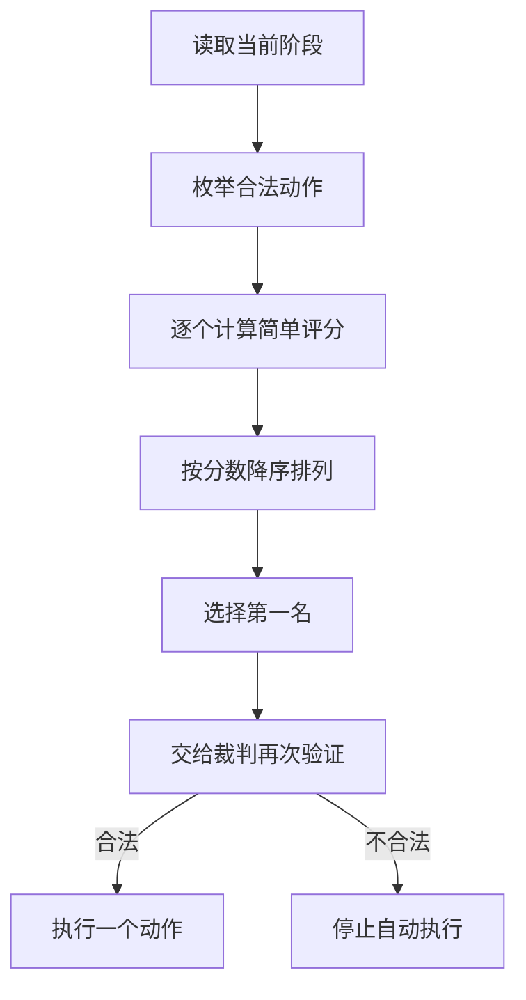

# 简单规则 AI 设计说明

**控制器值：** `heuristic_ai`  
**界面名称：** 简单规则 AI  
**主要实现：** `suggestHeuristicAction()`、`scoreAiAction()`

## 1. 定位

简单规则 AI 是项目的基础自动对手。它的设计目标不是表现出复杂战术，而是稳定、快速地完成合法行动。

它主要承担三个角色：

1. 为新玩家提供行为容易理解的基础对手。
2. 在规则和界面修改后快速验证一局游戏能否继续推进。
3. 作为复杂规则 AI 和模型指挥官 AI 的比较基线。

它不是随机 AI。它会为合法动作计算分数，并选择当前分数最高的动作。

## 2. 输入

简单规则 AI 不通过 API 接收一段文本上下文，而是直接读取前端内存中的当前游戏状态。

主要输入包括：

- 当前场景；
- 当前回合；
- 当前阶段；
- 当前行动方；
- 当前行动方可用单位；
- 单位位置、攻击力、移动力和状态；
- 单位补给状态；
- 目标格；
- 目的地地形；
- 敌军控制区；
- 本地裁判生成的合法移动和战斗候选。

它不会读取自然语言规则书，也不会自己解释规则。规则引擎已经提前把不合法动作过滤掉。

## 3. 决策流程



具体步骤为：

1. `enumerateLegalAiActions()` 根据当前阶段生成动作。
2. 每个动作进入 `scoreAiAction()`。
3. 候选按分数从高到低排序。
4. 选择第一名作为最终动作。
5. `validateAiAction()` 再次确认动作合法。
6. 前端播放并执行动作。
7. 下一步基于更新后的局面重新计算。

## 4. 它能选择哪些动作

简单规则 AI 与其他控制器使用相同的阶段动作合同：

| 阶段 | 可选动作 |
| --- | --- |
| 初始移动 | 移动、十月后期撤出、结束阶段 |
| 战斗 | 战斗、结束阶段 |
| 机械化移动 | 移动、十月后期撤出、结束阶段 |
| 补给移动 | 移动、十月后期撤出、结束阶段 |

一次决策只移动一个单位或执行一场战斗，不会一次生成整回合的命令序列。

## 5. 移动评分

对于一个移动动作，简单规则 AI 会先找出：

- 单位当前位置；
- 路径终点；
- 当前设置的目标格；
- 起点到目标的距离；
- 终点到目标的距离。

基础进展量可以理解为：

```text
向目标前进量 = 起点到目标的距离 - 终点到目标的距离
```

然后把进展量乘以目标权重，再叠加以下因素。

### 5.1 加分项

- 向目标格靠近；
- 进入阿拉曼方框区域；
- 进入山脊地形；
- 合法使用道路模式；
- 较强单位获得少量额外权重。

### 5.2 扣分项

- 进入敌军控制区；
- 当前单位无补给；
- 当前单位孤立。

### 5.3 它没有考虑的内容

简单评分不会详细判断：

- 相邻敌军总战斗力是否超过自身防御；
- 补给单位是否脱离护卫；
- 几个单位移动后能否在下一阶段联合攻击；
- 是否为了终局 VP 保存某个高价值单位；
- 十月撤出是否还来得及；
- 整条战线是否出现缺口。

所以它可能做出局部前进正确、整体战术普通的动作。

## 6. 战斗评分

战斗候选由本地裁判生成。简单规则 AI 不会自行猜测哪些单位能够联合攻击。

每个合法战斗候选包含：

- 攻击单位；
- 防御格；
- 总攻击力；
- 总防御力；
- 赔率列；
- 1 到 6 的 CRT 结果。

简单规则 AI 主要根据以下内容评分：

- 赔率列越靠右，得分越高；
- 六个骰面平均结果越有利，得分越高；
- 参战单位总攻击力提供少量加分。

它能选择联合攻击，因为候选生成器会提供多个相邻攻击者的组合。但它不会深入分析目标 VP、补给价值或撤退空间，这些属于复杂规则 AI 的能力。

## 7. 输出

简单规则 AI 最终返回统一动作对象。例如移动：

```json
{
  "type": "move",
  "unit": "july-62-It-mech-01",
  "path": ["3208", "3308", "3407"],
  "mode": "normal"
}
```

战斗：

```json
{
  "type": "combat",
  "attackers": ["axis-unit-a", "axis-unit-b"],
  "defender_hexes": ["3414"]
}
```

没有候选时：

```json
{
  "type": "pass",
  "reason": "没有合法动作"
}
```

它不能在战斗动作中指定骰点。随机骰点仍由前端裁判生成。

## 8. 优点

- 不依赖网络和外部 API。
- 决策速度快。
- 行为可重复、容易调试。
- 每个分数来源容易解释。
- 适合自动回归和完整对局冒烟测试。
- 即使评分不理想，动作仍经过裁判，规则合法性有保证。

## 9. 局限

- 只比较当前一步，不搜索未来。
- 没有正式战役计划。
- 不会主动组织多阶段协同。
- 对补给、阵型和兵力保存的理解较浅。
- 不同场景之间的行为差异较小。
- 在存在多个相近路线时，容易只看目标距离。
- 能执行联合攻击，但不等于理解完整的联合进攻战术。

## 10. 测试方式

简单规则 AI 主要通过以下方式验证：

- 在三个场景中检查是否只提交当前阶段允许的动作；
- 检查每个动作能否通过 `validateAiAction()`；
- 使用 `ai_replay.js` 进行可重复对局；
- 使用 `rule_engine.test.js` 保证移动与战斗候选本身符合规则；
- 与复杂规则 AI 在同一局面比较候选排名和最终动作。

## 11. 适合怎样理解它

简单规则 AI 可以理解为一个“合法动作排序器”。

它已经会移动、会战斗、会使用联合攻击候选，也能完成对局；但它的智能主要来自当前动作的局部评分，而不是长线战术推演。
