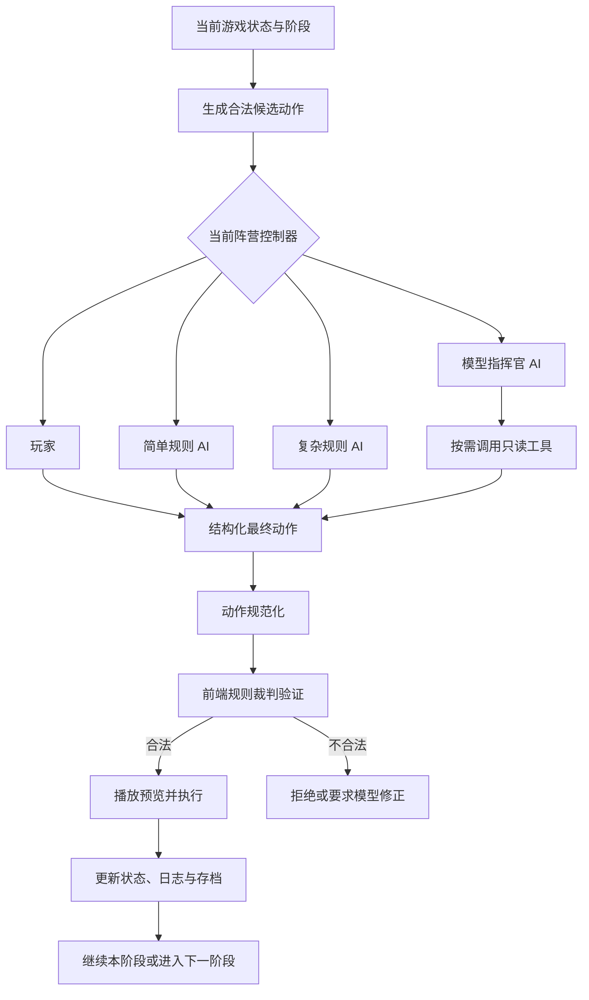

# 阿拉曼裁判工作室 AI 设计说明

**文档日期：** 2026 年 7 月 26 日  
**对应版本：** v2026.07.12.95  
**适用项目：** El Alamein Judge Studio  
**文档性质：** 当前实现说明与下一阶段设计依据

> 核心结论：本项目中的 AI 不是裁判，也不能直接修改游戏状态。AI 只负责在当前阶段提出一个行动，所有路径、战斗、撤退、补给和胜负结果都由同一套前端规则裁判验证并执行。

> **分册阅读：** 为避免把三种 AI 的决策机制混在一起，本说明已经拆分为[简单规则 AI](./AI设计/简单规则AI设计.md)、[复杂规则 AI](./AI设计/复杂规则AI设计.md)和[模型指挥官 AI](./AI设计/模型指挥官AI设计.md)三份独立设计文档。[AI 设计总览](./AI设计/README.md)提供三者的直接对照。本文件继续保留共同架构和完整技术参考。

## 1. AI 设计目标

阿拉曼裁判工作室的 AI 设计不是让模型自由描述一段作战故事，而是让不同类型的决策者在严格兵棋规则下完成真实对局。

系统希望同时满足五个目标：

1. **规则一致。** 玩家、简单规则 AI、复杂规则 AI 和模型指挥官 AI 使用同一份游戏状态，并接受同一套规则引擎裁判。
2. **行动可执行。** AI 的输出必须是结构化动作，不接受“向东推进”“尝试包围”这类无法直接落地的自然语言命令。
3. **决策可解释。** 系统能够记录候选动作、评分、风险、模型理由、裁判结果和最终局面变化。
4. **过程可观看。** AI 不应在一瞬间完成整回合。每次移动、战斗、骰点和撤退都要在地图上分段展示。
5. **架构可比较。** 同一个局面可以分别交给简单规则、复杂规则或外接模型，从而比较不同 AI 的合法率、动作质量和最终战果。

这套设计把“会不会玩”和“能不能守规则”拆成了两个问题：

- AI 决定做什么。
- 裁判决定能不能做，以及执行后发生什么。

## 2. 总体架构

当前每个阵营都可以独立选择一种控制器：

| 内部值 | 界面名称 | 决策方式 |
| --- | --- | --- |
| `human` | 玩家 | 玩家在地图和操作台上选择行动 |
| `heuristic_ai` | 简单规则 AI | 枚举合法动作并使用较小的直接评分公式排序 |
| `rules_ai` | 复杂规则 AI | 结合目标、补给、地形、控制区、战斗风险和场景策略评分 |
| `external_ai` | 模型指挥官 AI | 把结构化局面交给外接大模型，允许模型调用只读工具后提交行动 |

四种控制方式在“如何选择动作”上不同，但从动作提交开始会进入同一条执行链。



这一架构的重要意义是：即使外接模型出现幻觉，编造一条路线，选择错误阶段的动作，甚至返回格式错误的内容，也不能绕过规则引擎直接移动棋子。

## 3. AI 的操作粒度

### 3.1 一次只决定一个动作

AI 的基本操作粒度是“一次决策提交一个动作”，而不是一次生成整回合计划。

例如在初始移动阶段，AI 每次只移动一个单位；执行成功后，系统重新读取最新局面，再为下一个动作生成候选。这样做有三个优点：

- 上一个动作产生的控制区、堆叠和补给变化会立即反映到下一次决策中。
- 玩家可以看清每一步，不会出现多个棋子瞬间跳动。
- 某一步被裁判拒绝时，可以立刻停止，不会继续执行建立在错误状态上的后续计划。

### 3.2 不同阶段允许不同动作

AI 不是在任何时候都能看到并选择移动、战斗、补给等所有按钮。系统会根据当前阶段提供动作合同。

| 当前阶段 | 允许提交的最终动作 |
| --- | --- |
| 初始移动 | `move_intent`、`move`、十月后期的 `exit_west`、`pass` |
| 机械化移动 | `move_intent`、`move`、十月后期的 `exit_west`、`pass` |
| 补给移动 | `move_intent`、`move`、十月后期的 `exit_west`、`pass` |
| 战斗 | `combat`、`pass` |
| 无须主动操作的阶段 | 通常只有 `pass`，或由系统直接推进 |

因此，移动阶段不会要求模型决定战斗，战斗阶段也不会向模型提供移动动作。这和玩家界面只显示当前阶段所需操作的设计保持一致。

### 3.3 `pass` 的含义

`pass` 表示当前阶段不再执行行动并进入下一阶段。

它不是无条件安全的默认答案。模型指挥官如果在存在高价值合法动作时选择 `pass`，最终动作复核会把它退回模型，要求选择更强的合法行动。复杂规则 AI 也只会在没有达到最低评分的动作时跳过阶段。

## 4. AI 从开局到终局的完整流程

### 4.1 创建对局

玩家选择场景和双方控制器后，系统创建游戏状态与自动存档。场景数据决定：

- 初始单位与位置；
- 双方先后手；
- 阶段顺序；
- 最终回合；
- 特殊规则；
- 补给源；
- 胜利点计算方式。

如果当前阶段属于 AI 控制阵营，自动执行器开始工作；如果属于玩家控制阵营，AI 停止并等待玩家。

### 4.2 每一步 AI 行动

每次 AI 行动依次经过以下流程：

1. 读取场景、回合、阶段和当前行动方。
2. 检查本阶段已经执行的动作数量。
3. 根据当前阶段枚举合法候选动作。
4. 由当前控制器选择一个动作。
5. 将动作规范化为统一结构。
6. 交给规则裁判做预验证。
7. 在地图上聚焦参战单位、路线或目标。
8. 若为战斗，由前端生成随机 1d6，并再次验证战斗。
9. 裁判执行移动、战斗、撤退、消灭或撤出。
10. 更新棋子状态、行动日志、历史记录和存档。
11. 若 AI 仍可行动，基于新局面开始下一次决策。
12. 若 AI 选择 `pass` 或达到动作预算，则进入下一阶段。

### 4.3 阶段与回合推进

自动执行器 `autoPlayAi()` 每次只处理一个动作。它会在以下情况停止或切换：

- 到达玩家控制的阶段时停止，等待玩家操作。
- AI 返回 `pass` 时结束当前阶段。
- 本阶段达到产品设定的动作预算时结束当前阶段。
- AI 返回非法动作且无法修正时停止自动执行。
- 到达最终胜负检查时停止普通行动并显示终局结果。
- 单次自动循环达到安全步数上限时暂时结束，再安排下一轮循环。

### 4.4 对局结束

到达场景最终回合的终局检查后，裁判根据场景规则计算 VP 和胜负等级。结束的游戏进入归档，可以查看最终结果和对局日志。

AI 不负责宣布胜负，也不能自行结束一局游戏。终局完全由场景规则和裁判状态决定。

## 5. 合法候选动作如何产生

候选动作由本地程序产生，不依赖大模型猜测规则。

### 5.1 移动候选

系统首先筛选：

- 属于当前行动方；
- 仍为 `fresh`；
- 是当前阶段允许移动的单位；
- 未被阶段限制、单位类型或特殊状态禁止移动。

然后从单位当前位置探索可达路径，并对每条路径调用裁判的 `checkMove()`。候选只保留裁判已经确认合法的动作。

候选生成会考虑：

- 单位移动力；
- 每格地形成本；
- 道路模式与道路方向；
- 敌军占据格；
- 敌军控制区；
- 从一个敌军控制区进入另一个控制区的限制；
- 雷区；
- 进入和离开堆叠的成本；
- 堆叠上限与临时超堆叠；
- 当前阶段对机械化、非机械化和补给单位的限制。

为控制性能，系统不会把地图上每个单位的每一条可能路线都塞给模型，而是先按单位优先级筛选，再保留较有战略意义的路线。

### 5.2 战斗候选

`enumerateCombatActions()` 首先寻找可参加战斗的单位：

- 当前行动方单位；
- 状态仍为 `fresh`；
- 本回合和本阶段尚未攻击；
- 没有处于孤立状态；
- 没有被尚未清除的敌方雷区阻止。

对于每个相邻敌军格，系统会组合：

- 单个攻击者；
- 攻击力最高的两个攻击者；
- 攻击力最高的三个攻击者；
- 所有相邻攻击者。

然后根据规则补齐必须同时列入的防御格，并调用不带骰点的战斗预判。只有合法攻击才会成为候选。

每个战斗候选会向 AI 暴露：

- 总攻击力；
- 总防御力；
- 赔率列；
- 1 到 6 每个骰点对应的 CRT 结果；
- 防御方撤退、消灭、交换的概率特征；
- 攻击方撤退、消灭、交换的风险；
- 目标是否位于阿拉曼核心区；
- 目标是否包含补给单位；
- 防御方可用撤退空间是否有限；
- 地形和雷区影响。

这里的“概率”来自六个等概率骰面上的结果统计，不是模型自行估算。

## 6. 简单规则 AI

简单规则 AI 的定位是基础对手和稳定回归基线。它没有长期规划，也不会搜索未来多个回合。

它的工作方式是：

1. 枚举当前阶段合法动作。
2. 为每个动作计算一个直接分数。
3. 按分数从高到低排序。
4. 执行第一名。

### 6.1 移动评分

简单规则 AI 的移动评分主要包含：

- 向设定目标格前进多少；
- 目标距离变化；
- 进入敌军控制区的惩罚；
- 无补给或孤立状态惩罚；
- 阿拉曼方框和山脊地形奖励；
- 道路模式小幅奖励；
- 单位自身攻击力权重。

这套公式适合快速产生一个方向基本正确的动作，但不理解完整战线，也不会为几步之后的联合进攻主动调整多个单位。

### 6.2 战斗评分

简单规则 AI 主要观察：

- 当前赔率位于战斗结果表的哪一列；
- 六个骰面结果的平均风险收益；
- 参战单位总攻击力。

它会选择评分最高的合法战斗，但对胜利点、撤退空间和补给目标的理解弱于复杂规则 AI。

### 6.3 适用场景

简单规则 AI 适合：

- 新玩家的基础对手；
- 快速检查一个场景能否自动推进；
- 规则改动后的确定性回归测试；
- 作为复杂规则 AI 和模型指挥官的比较基线。

## 7. 复杂规则 AI

复杂规则 AI 仍然是加权规则系统，但它比简单规则 AI 使用更多战场信息，并加入了场景目标和风险门槛。

### 7.1 移动目标

复杂规则 AI 会根据阵营、场景和回合选择不同目标：

- 一般情况下，轴心国向阿拉曼与东部胜利区域推进。
- 盟军优先守住阿拉曼核心区，并拦截附近轴心国，而不是盲目冲向轴心国后方补给源。
- 补给单位追随需要补给的前线编队，并避免暴露于敌军控制区。
- 十月场景前 10 回合，轴心国单位向西侧撤退准备区域集结。
- 十月场景第 10 回合后，轴心国优先向西边缘撤出可计分单位。

### 7.2 移动评分因素

复杂规则 AI 的 `rulesAiScore()` 综合考虑：

- 向场景目标取得的实际进展；
- 阵营方向是否符合场景战略；
- 到目标的剩余距离；
- 距离终局还剩多少回合；
- 单位是否有足够时间抵达目标或撤出地图；
- 补给、部分补给和孤立状态；
- 目标格受到多少敌军控制区影响；
- 相邻敌军总战斗力；
- 脆弱单位接敌风险；
- 雷区风险及工兵差异；
- 山脊、阿拉曼方框等地形价值；
- 道路模式是否真正有利；
- 单位攻击力和机动力；
- 补给单位是否脱离掩护；
- 盟军是否形成有效局部拦截；
- 十月场景轴心国撤出价值。

### 7.3 战斗评分与主动跳过

复杂规则 AI 的战斗评分包括：

- 赔率列位置；
- 六个 CRT 结果的平均价值；
- 防御方受损骰面数量；
- 防御方被消灭或撤退的可能性；
- 攻击方损失和撤退风险；
- 交换结果风险；
- 攻防总战斗力差；
- 目标格的胜利价值；
- 阿拉曼方框价值；
- 补给目标价值；
- 防御方撤退被堵塞的价值。

战斗动作必须达到最低分数 `165` 才会执行。否则 AI 会选择 `pass`，并给出两类明确原因：

- 当前没有相邻且符合规则的攻击目标。
- 存在合法攻击，但赔率或预期战果不利，因此保存兵力。

这项门槛让“合法攻击”与“值得攻击”成为两个不同概念。

### 7.4 十月场景专用逻辑

十月场景包含独立的轴心国撤退战略：

- 第 10 回合前，轴心国向西侧预备位置收缩和集结。
- 第 10 回合后，优先执行合法的 `exit_west`。
- 补给单位撤出具有额外价值。
- 作战单位按自身攻防价值计算撤出优先级。
- AI 会用单位移动力、当前列号和剩余回合估算能否及时到达西边缘。
- 已经来不及撤出的低价值单位会降低优先级，把动作预算留给更可能完成撤出的单位。

这部分是场景定制启发式，不是通用兵棋战略学习。

## 8. 模型指挥官 AI

模型指挥官 AI 通过兼容 Chat Completions 的外部 API 工作。当前默认配置使用 DeepSeek 提供方和 `deepseek-v4-flash` 模型，温度为 `0.25`，请求超时为 30 秒，最多允许 4 轮工具交互。

API Key 不写入源代码，也不应进入 Git 历史。它只通过本地配置或界面中的私有配置提供。

### 8.1 模型身份与任务

系统提示会明确告诉模型：

- 你是当前阵营的游戏代理，不是规则问答助手。
- 目标是赢得当前场景，而不是随便提交一个合法动作。
- 优先考虑胜利条件、节奏、补给、兵力保存和位置压力。
- 不得发明规则。
- 不确定时调用只读工具。
- 最终只返回紧凑 JSON。
- 战斗动作中不得自行指定骰点。

这解决了一个重要问题：如果只把棋盘数据交给通用聊天模型，它可能会解释局面，却不知道自己必须做出一个能执行的游戏动作。

### 8.2 模型响应协议

模型每一轮只能返回两种结构之一。

调用工具：

```json
{
  "type": "tool_call",
  "tool": "inspect_unit",
  "arguments": {
    "unit": "july-62-It-mech-01"
  }
}
```

提交最终行动：

```json
{
  "type": "final_action",
  "reason": "推进至目标区并保持脱离敌军控制区",
  "action": {
    "type": "move_intent",
    "unit": "july-62-It-mech-01",
    "destination": "3709",
    "mode": "auto"
  }
}
```

模型不能在同一条响应里同时执行多个动作，也不能用自然语言替代 JSON。

## 9. 给外接模型的上下文

### 9.1 为什么不直接发送完整原始存档

原始状态包含大量界面字段、历史字段和与当前决策无关的数据。如果把它原样交给模型，会带来三个问题：

- 上下文过长，真正重要的信息被淹没。
- 模型需要自行猜测字段含义，容易误读。
- 每步请求成本和延迟过高。

因此系统采用“结构化、有限、阶段化”的上下文。模型能看到做出当前决策所需的信息，但不会收到无边界的完整状态转储。

### 9.2 上下文结构

每次请求的主要内容包括：

| 区块 | 内容 |
| --- | --- |
| `protocol` | 允许的响应形状、当前阶段动作类型、压缩字段说明 |
| `game` | 场景、回合、最终回合、剩余回合、阶段、行动方、VP |
| `decision_brief` | 本次最重要的决策摘要、最高分候选、是否应避免 `pass` |
| `mission` | 模型身份、当前阵营、对手和阵营目标 |
| `rules_brief` | 阶段顺序、移动、战斗和补给的关键规则 |
| `victory` | 当前 VP、终局方式、胜负等级和双方得分方向 |
| `strategy` | 总体学说、当前阶段目标和优先级 |
| `objectives` | 阿拉曼、双方主目标和补给源位置 |
| `forces.active` | 己方部队统计和重点单位详细信息 |
| `forces.enemy` | 敌方部队统计和重点单位详细信息 |
| `unit_index` | 双方单位的紧凑索引，包含位置和主要能力值 |
| `battlefield_summary` | 按区域统计的兵力、补给、接触和目标压力 |
| `map_intel` | 与当前候选有关的地形、格子和前线情报 |
| `candidate_actions` | 已经由本地裁判验证并评分的候选动作 |
| `recent_log` | 最近发生的移动、战斗和阶段事件 |
| `tools` | 模型可调用的只读工具列表 |
| `tool_results` | 前几轮工具调用或最终动作复核的结果 |

### 9.3 模型是否看到双方所有单位

这是一个完整信息兵棋环境，不使用战争迷雾。模型会收到双方单位信息，但采用两层表示：

1. **详细部队摘要。** 每方最多 40 个重点单位，包含名称、位置、攻防、移动力、补给、地形、有效能力、能否行动和附近敌人。
2. **紧凑单位索引。** 每方最多 160 个单位，包含位置、类型、攻防、移动力、状态、补给和战区编码。

所以模型不会只看到当前可移动单位。它能够知道己方与敌方棋子的位置和能力值，也能知道单位位于北部、中央、南部以及西部、中部、东部哪个作战区域。

“最多 40 个详细单位”不等于其余单位完全不可见。其余单位通常仍出现在紧凑索引中，只是不会为每个单位展开附近敌人等高成本细节。若模型需要更多信息，可以调用 `inspect_unit` 或 `inspect_hex`。

### 9.4 上下文边界

当前默认限制为：

| 项目 | 上限 |
| --- | ---: |
| 生成合法动作时使用的动作数量 | 60 |
| 发给模型的主要候选动作 | 12 |
| 最近日志 | 8 条 |
| 每方详细单位 | 40 个 |
| 每方紧凑单位索引 | 160 个 |
| 地图情报格 | 16 个 |
| 前线重点单位 | 10 个 |
| 每个单位展开的附近敌人 | 3 个 |
| 每个候选移动单位的可达格 | 50 个 |
| 保留工具结果 | 6 条 |

默认不发送完整原始状态摘要。

### 9.5 模型拿到的是不是全部候选动作

不是。

本地程序可能生成更多合法动作，但只把排名靠前、风险和意义更清楚的最多 12 个主要候选交给模型，并始终保留一个 `pass` 作为兜底。

这样做是为了控制上下文长度，并避免模型在大量近似路线中浪费注意力。模型仍有三种扩展方式：

- 调用 `list_legal_actions` 查看更多合法动作；
- 调用 `find_path` 查询某单位到指定目标的路线；
- 提交一个非候选动作前，调用 `evaluate_action` 获取合法性、评分与风险。

因此它不是只能照抄 12 个动作，但系统会明确鼓励优先使用经过本地筛选的高质量候选。

## 10. 只读工具系统

模型可以调用八种工具：

| 工具 | 用途 |
| --- | --- |
| `list_legal_actions` | 列出更多已评分合法动作 |
| `check_move` | 检查一条明确路径是否合法 |
| `find_path` | 为单位寻找通向目标格的合法路径 |
| `check_combat` | 检查一组攻击者和防御格是否构成合法战斗 |
| `inspect_unit` | 查看一个单位的详细属性与当前行动资格 |
| `inspect_hex` | 查看一个格子的地形、单位、雷区和控制区 |
| `trace_supply` | 追踪指定单位的补给状态与补给路线 |
| `evaluate_action` | 综合评估动作合法性、评分、排名、风险和战术标签 |

所有工具都是只读的。工具返回信息，但不会移动棋子、掷骰、清雷、结算战斗或修改 VP。

工具调用采用逐轮方式：模型先请求一个工具，前端执行后把结果放入下一轮上下文，模型再决定继续查询还是提交最终动作。默认最多 4 轮工具交互，防止模型无限查询。

## 11. 移动设计：模型只决定单位和目的地

### 11.1 推荐输出

模型移动时优先提交：

```json
{
  "type": "move_intent",
  "unit": "july-62-It-mech-01",
  "destination": "3709",
  "mode": "auto"
}
```

这里模型只承担战略决策：

- 哪个单位行动；
- 要到哪个格子。

它不必自己列出沿途经过的每一格。

### 11.2 本地路径规划

收到 `move_intent` 后，本地规划器会分别尝试普通模式和道路模式：

1. 使用 `findLegalPath()` 寻找完整路径。
2. 使用 `checkMove()` 再次检查路径。
3. 计算移动力消耗和复杂规则评分。
4. 比较普通与道路方案。
5. 选择评分更高的合法路线。

解析后的动作类似：

```json
{
  "type": "move",
  "unit": "july-62-It-mech-01",
  "path": ["3208", "3308", "3407", "3508", "3608", "3709"],
  "mode": "normal",
  "destination": "3709",
  "spent": 8
}
```

### 11.3 为什么采用目的地意图

相比让模型输出完整路径，这种设计更合适：

- 模型负责“去哪”，路径规划器负责“怎么合法到达”。
- 模型不会因为漏算一格地形成本而浪费整个决策。
- 道路和普通模式可以由程序准确比较。
- 路径仍然完整展示给玩家，并接受同一裁判检查。
- 模型如果确实需要指定特殊路线，仍可以提交完整 `move` 动作。

这不是让模型绕过路径规则，而是把战略意图和机械执行拆给更适合的组件。

## 12. 战斗设计

### 12.1 模型选择什么

战斗阶段的最终动作结构为：

```json
{
  "type": "combat",
  "attackers": [
    "axis-unit-a",
    "axis-unit-b"
  ],
  "defender_hexes": [
    "3414"
  ]
}
```

模型决定：

- 哪些己方单位联合进攻；
- 攻击哪些规则要求列入的敌方格。

系统支持联合进攻，多个相邻单位的有效攻击力会合并，再与目标格的有效防御力计算赔率。

### 12.2 模型不能决定什么

模型不能：

- 自己填写骰点；
- 自己宣布战斗结果；
- 自己指定不符合规则的防御格；
- 直接删除、撤退或推进单位。

`combat` 动作中如果出现模型自带的 `die`，标准协议不会采纳。真正的 1d6 由前端裁判在执行时随机生成。

### 12.3 战斗执行

战斗过程为：

1. AI 提交攻击者和目标。
2. 裁判在不掷骰时检查相邻关系、单位资格、雷区、攻防值和赔率。
3. 界面聚焦所有参战单位和目标格。
4. 前端生成 1 到 6 的随机骰点。
5. 裁判按赔率列和骰点查询 CRT。
6. 界面显示攻击力、防御力、赔率、骰点和结果代码。
7. 裁判执行撤退、消灭、交换或战后推进。

AI 可以预先看到六种骰点各自会产生什么结果，但不能提前知道本次会掷出几点。

## 13. 撤退设计

撤退是战斗结果的强制执行部分，不是 AI 可以拒绝的独立战术动作。

### 13.1 玩家控制方

如果需要撤退的一方由玩家控制，玩家逐个单位选择完整撤退路线。界面会明确显示：

- 当前正在处理哪个单位；
- 还需要撤退几格；
- 当前格到哪些格合法；
- 哪些选择符合撤退优先级。

### 13.2 AI 控制方

如果撤退方由 AI 控制，规则引擎调用 `autoPlanRetreats()` 自动完成。它会逐个单位、逐格选择当前最高优先级的合法撤退格。

裁判检查：

- 敌军占据；
- 敌军控制区；
- 雷区；
- 地形与规则规定的撤退优先级；
- 堆叠；
- 被堵死时的消灭结果。

因此 AI 的攻击决策和战斗结果执行是分离的。攻击 AI 只选择是否攻击，哪一方需要撤退以及如何合法撤退由 CRT 和裁判决定。

## 14. 外接模型最终动作复核

外接模型返回最终动作后，不会立即执行。系统还会完成一层质量复核。

### 14.1 规范化

前端首先把不同写法转换为标准形式。例如：

- `destination`、`target`、`hex` 统一为目的地；
- 路径格统一为标准四位格号；
- 缺失的移动模式补为默认值；
- 无效空动作转为带原因的 `pass`。

### 14.2 合法性验证

规范化动作进入 `validateAiAction()`：

- `move_intent` 先规划完整路径；
- `move` 调用移动裁判；
- `combat` 调用不带骰点的战斗裁判；
- `exit_west` 检查十月场景、回合、阵营、阶段和西边缘条件；
- `pass` 可以合法结束阶段。

### 14.3 动作质量复核

`finalActionReviewForAi()` 会拒绝以下情况：

- 动作不合法；
- 移动没有实际改变位置；
- 有有用非 `pass` 候选时无理由跳过；
- 选择的候选排名低于第 5，且比最佳候选低超过 20 分；
- 非候选动作比最佳候选低超过 20 分。

若被拒绝，并且本次尚未使用修正机会，系统会把问题、最佳动作和修正指令放入下一轮上下文，让模型重新选择一次。

这层复核不是替模型做所有决定，而是避免明显的低质量输出，例如面对可用进攻却无故 `pass`，或选择远差于现成候选的路线。

### 14.4 JSON 修复

如果模型返回了 Markdown、额外解释或无法解析的 JSON，系统会发起一次紧凑格式修复请求：

- 温度降为 0；
- 只允许返回一个 JSON 对象；
- 不要求重新思考整个局面；
- 如果仍无法修复，则停止 AI 自动执行并报告错误。

## 15. AI 行动的视觉播放

AI 决策完成后不会直接静默改状态。系统先预演，再执行裁判结果。

### 15.1 移动

- 地图聚焦行动单位；
- 单位和路线进入当前行动高亮；
- 镜头移动到目的地；
- 裁判确认后移动棋子；
- 记录起点、终点和路径信息。

### 15.2 战斗

- 高亮本次所有攻击者；
- 标记防御目标；
- 展示攻防值与赔率；
- 显示随机骰点；
- 展示 CRT 结果说明；
- 再执行撤退、交换或消灭。

### 15.3 跳过战斗

AI 选择不战斗时，界面和日志会显示原因，例如“没有合法攻击目标”或“赔率与预期结果不利，保存兵力”。

### 15.4 播放速度

| 视觉效果 | 聚焦 | 预览 | 结果停留 | 阶段切换 |
| --- | ---: | ---: | ---: | ---: |
| 完整 | 700 ms | 1200 ms | 1700 ms | 1800 ms |
| 精简 | 500 ms | 800 ms | 1100 ms | 1000 ms |
| 关闭 | 400 ms | 650 ms | 900 ms | 650 ms |

这些延迟用于提高可读性，不属于原版规则。

## 16. 动作预算与对局节奏

自动执行器为每个阶段设置动作预算，避免 AI 在单位很多的阶段连续执行过多动作，导致一局观看时间过长。

### 16.1 七月场景

| 阶段 | 轴心国 | 盟军 |
| --- | ---: | ---: |
| 初始移动 | 10 | 7 |
| 机械化移动 | 4 | 3 |
| 战斗 | 3 | 2 |
| 补给移动 | 2 | 2 |

### 16.2 非七月标准阶段

| 阶段 | 单方预算 |
| --- | ---: |
| 初始移动 | 4 |
| 机械化移动 | 2 |
| 战斗 | 1 |
| 补给移动 | 1 |

### 16.3 十月场景

十月前期采用更小的预算：初始移动 2、机械化移动 1、战斗 1；补给移动为轴心国 2、盟军 1。

第 10 回合后，轴心国撤退阶段使用更大的撤出预算：初始移动 35、机械化移动 16、补给移动 5，并停止主动战斗预算，以便完成大量单位向西撤出。

这些数字是产品播放节奏控制，不是原版规则的一部分。达到预算不代表其余单位按规则不能行动，只表示自动 AI 在当前版本中会结束该阶段。

## 17. 一次真实结构的模型决策示例

下面使用当前测试上下文中的七月第 7 回合轴心国初始移动局面。为便于阅读，只摘录真实请求结构中的关键部分。

### 17.1 给模型的系统任务摘要

```text
You are the game agent for the active side in El Alamein.
Your objective is to win the scenario, not merely to output any legal move.
Only return final actions allowed by the current phase.
For movement, prefer move_intent with unit + destination + mode:auto.
Never include die rolls in combat.
Return compact JSON only.
```

### 17.2 给模型的局面输入节选

```json
{
  "game": {
    "scenario": "july",
    "turn": 7,
    "final_turn": 7,
    "turns_remaining": 1,
    "phase": "axis_initial_movement",
    "phase_kind": "initial_movement",
    "active_side": "axis"
  },
  "decision_brief": {
    "allowed": ["move_intent", "move", "pass"],
    "phase_goal": "Choose the strongest legal move that improves victory position without reckless exposure.",
    "top": {
      "score": 170,
      "type": "move",
      "summary": "july-62-It-mech-01 3208 -> 3709; objective distance 8 -> 2.",
      "risks": []
    },
    "pass_policy": "Do not pass while useful non-pass candidates exist unless a tool proves them bad."
  },
  "mission": {
    "identity": "game_agent",
    "side": "axis",
    "opponent": "allies",
    "objective": "Win as Axis by raising VP, maintaining supply, pressuring Alamein/eastern routes, and avoiding wasteful losses."
  },
  "candidate_actions": [
    {
      "score": 170,
      "action": {
        "type": "move",
        "unit": "july-62-It-mech-01",
        "path": ["3208", "3308", "3407", "3508", "3608", "3709"],
        "mode": "normal",
        "destination": "3709",
        "spent": 8
      },
      "evaluation": {
        "distance_before": 8,
        "distance_after": 2,
        "progress": 6,
        "map_area": ["northern coastal sector", "eastern objective area"],
        "enemy_zoc_sources": [],
        "enemy_mines": [],
        "tactical_tags": ["objective progress"],
        "risks": []
      }
    }
  ]
}
```

完整请求还包含双方部队、单位索引、地图区域、附近敌人、胜利条件、规则摘要、近期日志和工具定义。

### 17.3 模型输出

```json
{
  "type": "final_action",
  "reason": "Use reviewed best candidate",
  "action": {
    "type": "move_intent",
    "unit": "july-62-It-mech-01",
    "destination": "3709",
    "mode": "auto"
  }
}
```

### 17.4 本地解析与执行

本地路径规划器把意图解析为：

```json
{
  "type": "move",
  "unit": "july-62-It-mech-01",
  "path": ["3208", "3308", "3407", "3508", "3608", "3709"],
  "mode": "normal",
  "destination": "3709",
  "spent": 8
}
```

随后规则引擎确认路径合法，前端在地图上依次聚焦单位、展示路线和目标，再把单位从 `3208` 移动到 `3709`。执行完成后该单位变为已行动状态，下一次 AI 决策会基于更新后的局面重新生成候选。

### 17.5 复核如何阻止无意义跳过

在同一测试中，第一轮模拟模型曾返回：

```json
{
  "type": "final_action",
  "action": {
    "type": "pass",
    "reason": "Mock pass to test review"
  }
}
```

最终动作复核检测到：

- 当前存在 170 分的有效移动；
- `pass` 排在候选末尾；
- `pass` 比最佳动作低 1169 分。

系统没有执行它，而是把最佳动作和修正要求返回模型。模型第二轮才提交上面的 `move_intent`。这说明外接模型不是“说什么就执行什么”。

## 18. 安全性与规则保证

系统通过多层边界保护游戏状态：

1. **上下文层。** 只提供当前阶段允许的动作类型。
2. **候选层。** 主要候选在发送前已经经过规则检查。
3. **工具层。** 模型工具只读，不能修改状态。
4. **协议层。** 模型只能返回工具调用或单个最终动作。
5. **规范化层。** 外部字段被转换为统一动作结构。
6. **验证层。** 最终动作必须通过前端裁判。
7. **质量层。** 明显劣于最佳候选的动作会得到一次修正机会。
8. **执行层。** 只有裁判确认合法后才写入游戏状态。
9. **日志层。** 每次选择、骰点、结果和阶段变化都有记录。
10. **停止机制。** 非法动作、API 错误或无法修复的格式错误会停止自动执行，而不是猜测执行。

## 19. 测试与评估体系

AI 并不是只通过人工试玩验证。项目目前包含以下工具：

| 文件 | 作用 |
| --- | --- |
| `external_ai_transcript.js` | 构造模型上下文并记录每轮输入、输出、工具结果和最终动作 |
| `external_ai_context_audit.js` | 检查上下文字段、阶段动作合同和场景覆盖 |
| `external_ai_quality.js` | 检查候选数量、上下文大小、风险信息和候选质量 |
| `external_ai_rollout.js` | 在模拟推进中检查候选是否持续可执行 |
| `external_ai_eval.js` | 对决策转录做合法性、质量与真实性评估 |
| `external_ai_real_check.js` | 对真实外部提供方进行请求检查 |
| `external_ai_probe.js` | 对指定局面和动作进行定向探测 |
| `external_ai_smoke.js` | 汇总语法、上下文、质量、回放和规则测试 |
| `ai_replay.js` | 进行可重复的完整 AI 对局回放 |
| `rule_engine.test.js` | 验证移动、战斗、撤退、补给和 VP 等核心规则 |

当前规则引擎包含 29 项自动化测试，覆盖：

- 三个场景回合顺序；
- 敌军控制区移动；
- 道路模式；
- 堆叠与移动力成本；
- 联合攻击与赔率；
- 山脊对撤退结果的影响；
- 玩家和 AI 撤退规划；
- 补给路径；
- 雷区和工兵；
- 交换损失；
- 场景 VP。

外接模型评估不仅检查“请求成功”，还检查：

- 上下文是否包含胜利目标；
- 当前阶段动作类型是否正确；
- 候选是否都带风险和胜利影响；
- `pass` 是否保留为最后兜底；
- `move_intent` 是否能解析为完整合法路径；
- 模型是否使用了真实 API，而不是误把模拟响应当成真实模型结果；
- 最终动作复核是否能够纠正明显低质量选择。

## 20. 当前能力边界

必须明确，当前 AI 已经可以完成对局，但还不是深度战略规划系统。

### 20.1 已经实现

- 三类 AI 都能读取当前阶段并提交合法动作。
- 简单和复杂规则 AI 能自动移动与战斗。
- 模型指挥官能读取双方单位、位置、战区、能力、补给、候选和近期事件。
- 模型可以查询路径、单位、格子、补给和战斗。
- 模型移动可以只提交目的地，由本地规划完整路线。
- AI 可以组织联合攻击。
- 战斗骰点由裁判随机产生。
- AI 控制方可以自动完成强制撤退。
- AI 行动有地图聚焦、预览、骰点和结果播放。
- 终局由规则裁判计算并归档。

### 20.2 尚未实现或仍有限

- 简单和复杂规则 AI 都不是 Minimax、MCTS 或强化学习系统。
- 当前不会搜索完整的多回合行动树。
- 候选生成有性能边界，不枚举地图上所有可能路线组合。
- 复杂规则 AI 的部分能力来自场景定制，特别是十月轴心国撤退。
- 动作预算为了观看节奏会提前结束 AI 阶段，可能放弃仍然合法的单位行动。
- 外接模型质量取决于上下文、模型能力和 API 稳定性。
- 当前只保留短期近期日志，没有形成跨回合的正式战役计划记忆。
- 多单位协同目前主要体现在同一战斗的联合攻击，而不是完整的多步包围计划。
- 十月场景仍有少量地图坐标和撤出数据需要继续复核。
- 真实模型的完整对局样本仍需扩大，不能只用少数成功动作证明整体战略质量。

## 21. 下一阶段 AI 设计建议

### 21.1 建立统一评测局面集

从三场战役中固定一组代表性局面：

- 目标区推进；
- 敌军控制区突破；
- 雷区前的工兵协同；
- 补给线保护；
- 联合攻击；
- 不利赔率下是否保存兵力；
- 十月轴心国撤出。

每个局面让三类 AI 分别决策，并记录合法率、评分、最终 VP 和人工评价。

### 21.2 加入战役计划记忆

模型指挥官可以维护一个受控、可审计的短期计划，例如：

```json
{
  "objective": "压迫阿拉曼北侧并保持补给",
  "priority_units": ["unit-a", "unit-b"],
  "avoid": ["让补给单位进入敌军控制区"],
  "review_at": "next_combat_phase"
}
```

计划只作为下一步决策上下文，不能直接执行，也必须允许裁判和局面变化推翻。

### 21.3 提升多动作协同

当前“一次一个动作”的执行方式应保留，但可以增加本地短视规划：

- 先评估若干两步或三步行动序列；
- 第一动作执行后重新验证剩余计划；
- 局面变化时立即放弃旧计划；
- 记录计划完成率和失败原因。

### 21.4 分离战略评分与规则评分

当前复杂规则评分同时承担合法候选排序和战略价值估计。后续可拆分为：

- 规则可行性；
- 局部战术收益；
- 补给和生存风险；
- 场景 VP 影响；
- 长期位置价值。

这样更容易解释为什么某个动作被选中，也更便于对各权重做自动调参。

### 21.5 完善战后 AI 复盘

终局报告应增加：

- 双方各阶段执行动作数；
- AI 主动跳过的战斗；
- 关键骰点；
- 最大赔率战斗；
- 单位损失和补给崩溃；
- 直接改变 VP 的行动；
- AI 建议与实际裁判结果的差异；
- 简单规则、复杂规则和模型指挥官的对照统计。

## 22. 代码位置

AI 设计的主要实现位于：

- `app.js`：前端 AI、候选生成、评分、外接模型上下文、工具、复核、自动执行和视觉播放。
- `ai/config/ai_config.yaml`：非秘密的模型提供方和上下文边界配置。
- `ai/prompt/prompts.yaml`：统一管理战略、系统提示、步骤模板、阶段意图、浏览器和上下文压缩 Prompt。
- `rule_engine.js`：移动、战斗、撤退、补给、VP 和终局裁判。
- `movement_worker.js`：移动范围和路径计算的后台执行。
- `ai_replay.js`：可重复的 AI 对局回放。
- `ai/experiments/external_ai_*.js`：外接模型上下文、探测、质量、回放和评估工具。
- `rule_engine.test.js`：核心规则自动化测试。

## 结语

阿拉曼裁判工作室的 AI 设计可以概括为三层：

1. **决策层**选择想做什么。
2. **规划层**把目的地或战斗意图转换为可执行动作。
3. **裁判层**决定动作是否合法并执行结果。

简单规则 AI 提供稳定基线，复杂规则 AI 提供场景化战术，模型指挥官 AI 提供更灵活的局面理解与工具推理。三者都不能越过裁判。

这套结构的价值不只在于让 AI 能够玩一局游戏，更在于每一次决策都可以被查看、验证、复现和比较。后续无论接入更强模型、加入计划记忆，还是改进规则 AI，都可以在不破坏规则可信度的前提下继续演进。
