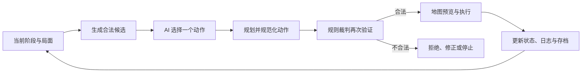

# 从规则数字化到可玩的 AI 兵棋系统

## El Alamein Judge Studio 阶段进展

**进展日期：** 2026 年 7 月 26 日  
**当前版本：** v2026.07.12.95  
**项目阶段：** 可完整对局的体验优化与 AI 验证阶段

> 一句话进展：项目已经从“规则验证原型”推进为一套可以完成场景选择、单位移动、战斗结算、补给判定、胜负结算、存档归档和 AI 对局的网页兵棋系统。当前重点已经从“能不能跑”转向“是否好玩、是否看得懂、AI 是否像一个真正的指挥官”。

## 1. 我们正在做什么

El Alamein Judge Studio 以《El Alamein》原版规则为基础，目标不是做一个自由移动棋子的地图编辑器，而是把一套传统桌面兵棋转化为可验证、可操作、可由 AI 参与的数字对局环境。

玩家或 AI 只负责提出行动：移动到哪里、哪些单位参加攻击、是否结束阶段。真正决定动作是否合法、移动消耗多少、战斗结果如何执行的，是同一套内置裁判。这样可以让人类玩家、规则 AI 和外接大模型在完全一致的规则环境中对局。

目前系统已经覆盖三个历史场景：

- **七月：第一次阿拉曼战役。** 共 7 回合，轴心国先行动，重点是东进压力、阿拉曼方向和补给线。
- **九月：阿拉姆哈勒法战役。** 共 7 回合，包含第 1 回合特殊阶段顺序与轴心国首回合攻击加倍。
- **十月：第二次阿拉曼战役。** 共 15 回合，盟军先行动，并包含后期轴心国向西撤出与胜利点计算。

## 2. 当前已经完成的核心能力

### 2.1 规则裁判

规则引擎已经可以独立检查并执行主要对局规则：

- 回合与阶段顺序，包括初始移动、战斗、机械化移动、补给移动和回合结束结算。
- 普通移动与道路模式，按单位类型、地形、道路、堆叠和移动力计算路径成本。
- 敌军控制区、雷区、海面、地图边界及临时超堆叠限制。
- 单位堆叠、机械化与非机械化差异，以及工兵、侦察、补给等单位角色。
- 联合攻击、攻防战斗力、赔率换算、1d6 随机骰点和战斗结果表。
- 撤退、无路可退消灭、交换损失和战后推进。
- 补给链、部分补给、无补给、孤立与回合结束消灭。
- 三个场景各自的胜利点和终局判定。

最近一个重要变化，是把“动作失败”从简单的拒绝改成可解释的裁判结果。例如单位无法移动时，界面会指出具体在哪一步被阻断，并列出地形、离开堆叠、进入堆叠等移动力成本，而不是只显示“路线不可达”。

### 2.2 完整对局闭环

系统已经具备从进入游戏到对局结束的完整流程：

1. 选择历史场景。
2. 为轴心国和盟军分别选择玩家、简单规则 AI、复杂规则 AI 或模型指挥官 AI。
3. 创建自动存档并进入对局。
4. 按裁判阶段完成移动、战斗、补给和回合结算。
5. 离开游戏时保存当前状态。
6. 对局结束后归档战役，并保留最终胜负和对局日志。

规则书与棋子图册已经拆分为独立页面。玩家可以在游戏内直接查看完整规则、专业术语、战斗结果表以及各类棋子的图标与作用。

### 2.3 游戏化界面

前端已经从早期的工具型面板改造成“北非战地指挥部”风格：

- 首页使用战区地图、历史日期、场景时间轴和双方部队徽记建立时代氛围。
- 地图保持为对局主体，顶部集中显示回合、当前阶段与 VP。
- 右侧操作台只显示当前阶段需要的功能，移动阶段不再堆放战斗控件，战斗阶段也不再显示无关移动操作。
- 点击局面中的单位会把地图视角移动到对应棋子，并在地图中突出选中单位。
- 轴心国与盟军棋子采用不同外框；当前行动单位、不可行动友军和敌军使用不同视觉状态。
- AI 行动会放慢并分段播放，玩家能看清选中单位、移动路线、战斗目标、骰点、赔率和最终结果。

### 2.4 性能与交互

针对“点击棋子和地图明显卡顿”的问题，移动范围与自动寻路已经转移到 Web Worker 中执行，并增加结果缓存。地图只重绘真正发生变化的部分，避免每次点击都同步计算全部单位的补给、可达范围和路径。

目前点击单位、切换右侧功能、规划路线和定位棋子的响应已经明显改善。移动失败、战斗选择和撤退过程也提供了更直接的下一步提示。

## 3. AI 设计与实现进展

AI 的完整技术设计已纳入本阶段成果。本节记录与当前版本直接相关的设计结论；更细的评分公式、协议字段、输入输出示例和测试方法见[AI 设计总览](./AI设计/README.md)与[AI 完整技术说明](./阿拉曼裁判工作室_AI设计说明_2026-07-26.md)。

### 3.1 设计原则

当前设计遵循五项原则：

1. **规则一致：**玩家和AI 共用同一份游戏状态与规则裁判。
2. **动作可执行：** AI 必须提交移动、战斗、撤出或跳过等结构化动作，不能只给自然语言命令。
3. **决策可解释：** 候选评分、风险、选择理由、裁判结果和局面变化可以记录与复核。
4. **过程可观看：** 一次只执行一个动作，并在地图上分段展示移动、战斗、骰点和撤退。
5. **结果可比较：** 同一局面可以交给不同 AI 决策，用合法率、动作质量和最终战果进行横向比较。

### 3.2 三类 AI 的分工

| 类型 | 决策方式 | 主要考虑 | 当前定位 |
| --- | --- | --- | --- |
| 简单规则 AI | 枚举合法动作并按直接评分排序 | 目标距离、基础地形、控制区、补给惩罚、战斗赔率 | 基础对手与稳定回归基线 |
| 复杂规则 AI | 使用场景化加权评分与风险门槛 | 胜利目标、补给、地形、敌军压力、兵力保存、CRT 风险、撤出价值 | 本地正式对手 |
| 模型指挥官 AI | 外接模型读取结构化局面，调用只读工具后提交动作 | 双方兵力、胜利条件、候选评估、地图情报、近期事件与模型推理 | 大模型游戏代理与 AI 研究 |

三类 AI 共享规则引擎和动作格式，但“如何做出选择”完全不同。以下分别说明它们的工作过程。

### 3.3 简单规则 AI 如何工作

简单规则 AI 的控制器值是 `heuristic_ai`，主要由 `suggestHeuristicAction()` 和 `scoreAiAction()` 实现。它可以理解为一个**合法动作排序器**：不调用外部 API，不读取自然语言规则书，也不自行推演规则，只对本地裁判已经确认合法的动作进行快速打分。

#### 3.3.1 输入

简单规则 AI 直接读取前端内存中的当前场景、回合、阶段、行动方、单位位置、攻防与移动力、行动状态、补给状态、目标格、目的地地形、敌军控制区，以及本地裁判生成的合法移动和战斗候选。

#### 3.3.2 决策流程

1. `enumerateLegalAiActions()` 根据当前阶段枚举合法动作。
2. `scoreAiAction()` 为每个候选计算简单分数。
3. 候选按分数从高到低排序。
4. AI 选择当前第一名，不生成整回合命令序列。
5. `validateAiAction()` 再次检查动作是否合法。
6. 前端播放并执行一个动作，然后基于新局面重新枚举下一步。

移动阶段的候选是单个单位的一条合法路径，战斗阶段的候选是一组合法攻击者与防御格。没有候选时，AI 返回 `pass` 并结束当前阶段。

#### 3.3.3 移动选择

移动的核心分数来自单位向目标格取得的距离进展：

```text
向目标前进量 = 起点到目标的距离 - 终点到目标的距离
```

在此基础上，进入阿拉曼方框、进入山脊、合法使用道路以及较强单位行动会获得少量加分；进入敌军控制区、单位无补给或处于孤立状态会被扣分。最终选择得分最高的合法路线。

这套评分不会详细判断附近敌军总战斗力、补给单位是否脱离护卫、几步之后能否联合进攻、终局 VP 保存价值或整条战线是否出现缺口。因此它可能做到“这一步方向正确”，但不一定形成完整战术。

#### 3.3.4 战斗选择

本地候选生成器先计算所有合法的单单位与联合攻击方案，并为每个方案提供总攻击力、总防御力、赔率列和 1 至 6 点对应的 CRT 结果。简单规则 AI 主要依据三项内容排序：

- 赔率列越有利，得分越高；
- 六个骰面结果的平均收益越高，得分越高；
- 参战单位总攻击力提供少量加分。

它能执行联合攻击，是因为候选生成器已经准备了合法组合，而不是因为它会主动规划跨阶段的协同作战。AI 只提交攻击者和防御格，实际骰点由前端裁判生成。

#### 3.3.5 特点与限制

简单规则 AI 决策快、无需联网、评分可重复，适合基础对手、自动回归和完整对局冒烟测试。它只比较当前一步，不搜索未来状态，也没有跨回合计划；对补给、阵型、兵力保存和场景差异的理解较浅。

完整设计见[简单规则 AI 设计说明](./AI设计/简单规则AI设计.md)。

### 3.4 复杂规则 AI 如何工作

复杂规则 AI 的控制器值是 `rules_ai`，主要由 `suggestRulesAction()` 和 `rulesAiScore()` 实现。它可以理解为一个**带场景知识的战术评分器**：仍然不调用外部模型，但会把更多战场特征、场景目标和风险门槛纳入选择。

#### 3.4.1 输入与候选优先级

除了简单规则 AI 使用的数据，复杂规则 AI 还读取剩余回合、单位类型、机械化与工兵属性、补给源、部分补给和孤立状态、敌军控制区来源数量、附近敌军战斗力、雷区、道路、阿拉曼目标区、场景 VP 条件及十月撤出条件。

为了控制计算量，它先按以下因素确定值得优先生成候选的单位：到战略目标的距离、攻防与移动力、是否为补给单位、是否接近目标区、盟军是否需要拦截附近敌军，以及十月轴心国单位是否还能及时撤出。这只是候选计算优先级，不是原版规则限制。

#### 3.4.2 决策流程

1. 读取场景、回合、阶段、行动方和剩余时间。
2. 建立本轮补给与局面评分缓存。
3. 由本地裁判生成合法候选。
4. `rulesAiScore()` 分别计算战术收益、场景价值和风险。
5. 候选按总分排序。
6. 检查最高分是否达到当前阶段的执行门槛。
7. 达到门槛时提交最高分动作；否则返回 `pass` 并说明原因。
8. 裁判再次验证并执行，下一步重新计算。

当前最低分数为：战斗 `165`、补给移动 `2`、轴心国其他移动 `4`、盟军其他移动 `6`。这些门槛是产品策略参数，不属于原版规则。

#### 3.4.3 移动选择

复杂移动评分会综合以下因素：

- **目标进展：** 起点和终点到场景目标的距离、实际前进格数、剩余回合以及终局前能否抵达。
- **行军方向：** 轴心国一般向东推进，盟军围绕阿拉曼与附近威胁调整，十月后期轴心国转为向西撤退。
- **接敌风险：** 目标格的敌军控制区来源、相邻敌军总战斗力、自身防御力、雷区和工兵差异。
- **补给风险：** 有补给、部分补给或孤立状态，补给单位是否脱离掩护，移动是否破坏编队。
- **地形道路：** 山脊防御价值、阿拉曼方框价值、道路是否真正节省移动以及实际 MP 消耗。
- **单位价值：** 攻击力、移动力、单位类型和潜在 VP 价值。

七月和九月的轴心国会优先向阿拉曼及东部胜利区域推进；盟军倾向守住核心区、保持补给并拦截附近轴心国，而不是盲目向西追逐补给源；补给单位则优先跟随前线，同时避免进入敌军控制区。

#### 3.4.4 战斗选择

候选生成器会组合单个攻击者、最强的两个或三个攻击者以及所有相邻攻击者，再由裁判过滤不符合相邻关系、行动状态、孤立、雷区和防御格要求的组合。

复杂规则 AI 不只看赔率，还统计整个赔率列六个骰面的结果，包括双方消灭、撤退、交换和受损骰面数。在此基础上，它会奖励阿拉曼目标、补给目标、撤退空间受限的敌军和能够打开胜利区道路的攻击；惩罚低赔率、攻击方高损失风险、交换风险以及为小目标投入过多高价值单位。

如果最高分低于 `165`，AI 会主动放弃攻击。日志会区分“没有合法目标”和“存在合法攻击，但赔率或预期战果不利，选择保存兵力”。因此，不攻击可能是明确的战术选择。

#### 3.4.5 十月场景撤出逻辑

十月第 10 回合前，轴心国逐步向西部集结，补给单位根据移动力前往预备位置。第 10 回合后，AI 优先执行合法的 `exit_west`，并按补给单位价值、作战单位攻防价值、当前位置、移动力和剩余回合估算撤出优先级，把有限动作预算留给最可能成功撤出的单位。最终撤出仍须由裁判检查场景、回合、阵营、阶段、单位类型和西边缘位置。

#### 3.4.6 特点与限制

复杂规则 AI 能保持补给、利用地形、选择联合攻击、回避不利战斗，并体现轴心国推进、盟军拦截和十月撤出等场景倾向。但它仍是人工设计权重的启发式系统，不进行 Minimax、MCTS、强化学习或多回合状态树搜索；固定权重和场景专用逻辑在特殊局面中可能失效。

完整设计见[复杂规则 AI 设计说明](./AI设计/复杂规则AI设计.md)。

### 3.5 模型指挥官 AI 如何工作

模型指挥官 AI 的控制器值是 `external_ai`。它可以理解为一个**受工具和裁判约束的大模型游戏代理**：模型负责理解局面和选择行动意图，本地程序负责构造候选、回答规则查询、规划路径、审查动作，规则引擎负责最终执行。

当前默认通过兼容 Chat Completions 的接口连接 DeepSeek `deepseek-v4-flash`，温度为 `0.25`，请求超时 30 秒，最多允许 4 轮工具交互。API Key 只通过本地私有配置提供，不写入源码或文档。

#### 3.5.1 模型看到什么

系统不会把完整原始存档直接交给模型，而是构造结构化、有限、阶段化的上下文：

- 场景、当前与最终回合、剩余回合、阶段、行动方和 VP；
- 当前阵营任务、胜利条件、场景目标、阶段策略和允许的动作类型；
- 每方最多 40 个重点单位的详细摘要，以及最多 160 个单位的紧凑索引；
- 各战区的兵力、攻防、补给、接触和阿拉曼附近压力；
- 最多 16 个相关格子的地形、道路、单位、雷区和控制区情报；
- 最多 8 条近期移动、战斗与阶段日志；
- 从最多 60 个合法动作中筛选出的最多 12 个主要候选及其评分、风险、VP 影响和 CRT 结果。

模型可以看到双方部队，不只看到当前可移动单位。详细摘要之外的单位通常仍在紧凑索引中，需要更多信息时可以调用工具。

#### 3.5.2 候选与只读工具

模型拿到的不是全部合法动作。系统优先提供最有意义的候选，并始终保留 `pass` 作为兜底。模型若要检查候选外方案，可以调用八种只读工具：

| 工具 | 作用 |
| --- | --- |
| `list_legal_actions` | 查看更多已评分合法动作 |
| `check_move` | 检查指定路径及移动模式 |
| `find_path` | 寻找某单位到目标格的合法路径 |
| `check_combat` | 检查攻击者与防御格，返回赔率和六面 CRT |
| `inspect_unit` | 查看单位属性、补给、地形和行动资格 |
| `inspect_hex` | 查看格子地形、单位、雷区与控制区 |
| `trace_supply` | 追踪单位补给状态和补给路线 |
| `evaluate_action` | 评估动作合法性、评分、排名、风险和战术标签 |

工具只能返回信息。调用 `find_path` 不会自动移动单位，调用 `check_combat` 也不会掷骰或结算战斗。

#### 3.5.3 一次决策怎样完成

1. 前端生成合法候选、局面摘要以及系统任务。
2. 模型收到明确身份：它是当前阵营的 game agent，目标是赢得场景，不是回答规则问题。
3. 模型返回 `tool_call` 查询信息，或返回一个 `final_action`。
4. 工具结果会加入下一轮上下文，模型可继续查询，最多 4 轮。
5. 最终 JSON 被解析、字段规范化并交给本地裁判验证。
6. `finalActionReviewForAi()` 比较动作合法性与候选质量。
7. 通过后先在地图上预览，再由裁判执行并记录日志。
8. 一个动作完成后，系统基于最新局面重新请求下一步决策。

模型每次只能提交一个动作，不能一次生成并直接执行整回合计划。移动阶段只允许 `move_intent`、`move`、特定条件下的 `exit_west` 或 `pass`；战斗阶段只允许 `combat` 或 `pass`。

#### 3.5.4 移动、战斗与撤退的职责边界

移动时推荐模型只提交 `move_intent`，即单位、目标格和 `auto` 模式。本地规划器分别尝试普通与道路模式，用 `findLegalPath()` 生成完整路径，再用 `checkMove()` 验证移动力、地形、道路、敌军占据、控制区、雷区和堆叠，最终选择评分更高的合法路线。模型负责“去哪”，程序负责“怎样合法到达”。

战斗时模型只提交攻击者和防御格，可以选择多个单位联合攻击，但不能填写骰点、CRT 结果、消灭单位或撤退方向。前端在执行时随机生成 1d6，由裁判计算赔率并结算。

若战斗结果要求 AI 控制方撤退，模型不再发起一次 API 决策。`autoPlanRetreats()` 按敌军、控制区、雷区、地形、堆叠和撤退优先级逐单位规划合法路线；无路可退时按规则消灭。

#### 3.5.5 最终动作复核与故障处理

以下模型动作会被拒绝并获得一次修正机会：动作不合法、移动没有改变位置、存在有用动作时无理由 `pass`、候选排名低于第 5 且比最佳候选低超过 20 分，或非候选动作比最佳候选低超过 20 分。修正上下文会提供拒绝原因、原动作评估和最佳候选。

模型返回无法解析的内容时，系统会使用温度为 0 的请求尝试修复一次 JSON；若再次失败，或遇到网络错误、超时和 API 错误，则停止自动执行并显示原因，不猜测执行。

#### 3.5.6 特点与限制

模型指挥官能结合胜利条件、双方部队、近期事件和工具查询做出比固定公式更开放的判断，输入、输出、工具调用和修正过程也可以完整记录。但其质量受模型、上下文、网络、延迟和成本影响；当前只有短期日志，没有正式的跨回合计划记忆，有限候选与质量复核也不能保证每一步全局最优。

完整设计见[模型指挥官 AI 设计说明](./AI设计/模型指挥官AI设计.md)。

### 3.6 三类 AI 的共同执行架构

三类 AI 共用“决策层、规划层、裁判层”三层结构：



- **决策层**决定使用哪个单位、前往哪里、是否进攻以及何时结束阶段。
- **规划层**把目的地或战斗意图转换为完整路径、攻击者和防御目标等标准动作。
- **裁判层**检查移动力、地形、道路、控制区、雷区、堆叠、战斗赔率、撤退、补给与终局规则，并执行结果。

AI 一次只决定一个动作。动作执行后，系统会基于更新后的局面重新生成候选，因此上一动作造成的控制区、堆叠或补给变化能够立即影响下一次决策。每个阶段还设置产品层动作预算，以控制自动对局的观看时长；动作预算不属于原版规则。

### 3.7 共同安全边界与当前能力

三类 AI 都不能直接改写游戏状态。系统从候选层、动作合同、规范化、裁判验证、视觉执行和日志记录等多个环节保证规则一致。只有裁判确认合法的动作才能写入局面，每次选择、骰点、结果和阶段变化都会进入日志与存档。

当前 AI 已能完成移动、联合攻击、自动撤退、补给移动、阶段推进和终局对局，但仍属于“可执行、可观察、可比较”的阶段，不应被描述为已经具备成熟的长期战略规划能力。

现阶段的主要限制包括：候选生成不会穷举所有路线组合；复杂规则 AI 的部分策略依赖场景定制；动作预算可能让 AI 放弃仍然合法的后续行动；模型只保留短期日志，还没有正式的跨回合战役计划记忆；多单位协同主要体现在联合攻击，而不是完整的多步包围计划。

## 4. 最近一轮重点优化

本轮工作主要围绕“让玩家始终知道发生了什么”展开：

- **移动解释：** 显示准确的阻断位置和 MP 成本明细。
- **战斗流程：** 合并目标选择与结算入口，增加结果表查看、随机骰点揭示和地形说明。
- **联合进攻：** 支持依次选择多个己方单位，再点击敌军目标发起联合攻击。
- **撤退选择：** 一次为一个单位选择完整撤退路线，明确当前处理的单位、允许撤退的格数和合法方向。
- **AI 撤退：** 如果撤退方由 AI 控制，则由 AI 自动规划并执行；人类控制方仍可选择合法路线。
- **AI 战斗播放：** 依次显示参战单位、目标、攻防值、赔率、骰点和战斗结果，再执行撤退或消灭。
- **阶段化操作台：** 只保留当前阶段真正可用的按钮，无法执行时按钮置灰。
- **信息降噪：** 删除重复面板、开发型入口和没有实际作用的状态标签，把规则、日志和高级调试放到更合适的位置。

## 5. 当前验证结果

- 规则引擎自动化测试：**29 项通过**。
- JavaScript 语法检查：核心前端、规则引擎与移动 Worker 均通过。
- 页面运行检查：v2026.07.12.95 正常加载，控制台无错误。
- 场景检查：七月从第 1 回合运行到第 7 回合；九月首回合跳过盟军初始移动；十月由盟军先行动。
- AI 回放：完整七月规则 AI 回放能够完成终局，并在对局中执行移动与战斗动作。
- 外接模型协议：已具备上下文审计、动作质量检查、模拟回放、最终动作复核和真实 API 检查脚本。

这些验证说明系统已经不只是静态演示，而是具备持续迭代所需的裁判测试与 AI 评估基础。

## 6. 仍在解决的问题

当前版本已经可玩，但还不是最终完成状态。接下来最重要的工作包括：

- 继续逐条核对原版规则中的边缘情况，尤其是十月场景的撤出坐标与少数地图数据。
- 扩大真人对局与模型对局样本，判断复杂规则 AI 和模型指挥官是否会形成更有目的的战线，而不仅是完成合法动作。
- 继续优化长对局中的 AI 节奏、战斗可读性和日志摘要。
- 补充终局战报，包括关键战斗、VP 变化、损失和战线推进过程。
- 完成移动端布局与低性能设备上的动画降级。
- 在不暴露 API Key 的前提下完善本地代理、配置导入和部署说明。

## 7. 下一阶段目标

下一阶段将从“规则正确、流程可用”推进到“对局有策略、结果可复盘”。计划重点是：

1. 建立固定的 AI 对局评测集，比较简单规则、复杂规则和外接模型在同一局面中的选择。
2. 为每次 AI 决策记录候选动作、选择理由、裁判结果和最终局面变化。
3. 强化战后报告，让一局游戏结束后能够直接看到决定胜负的几次行动。
4. 完成三个场景的规则与数据复核，并形成可重复的发布检查流程。
5. 继续打磨首页、地图、战斗和终局之间的视觉一致性。

## 结语

这段时间最大的变化，不只是界面变得更像游戏，而是系统已经形成了清晰的职责边界：玩家和 AI 做决策，路径规划器寻找执行方式，裁判验证规则，前端负责把结果讲清楚。

这让项目具备了一个更有价值的下一步：我们不仅可以继续做一款可玩的阿拉曼兵棋，也可以把它作为研究 AI 如何在严格规则、部分信息和长期目标下进行决策的实验环境。
